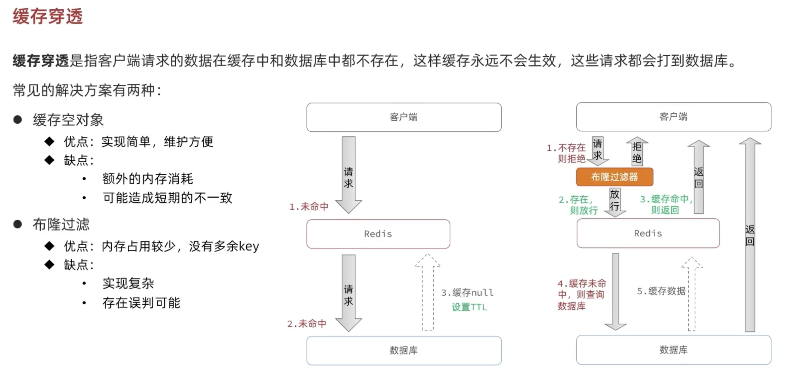
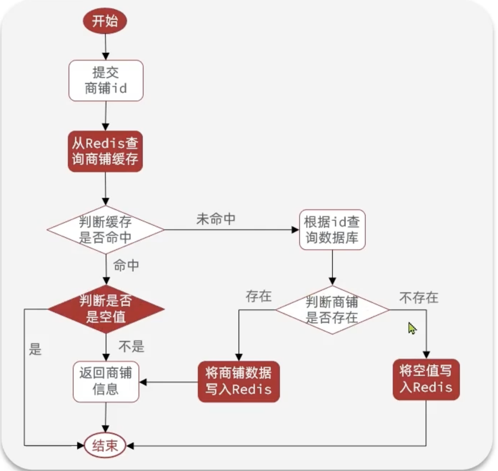
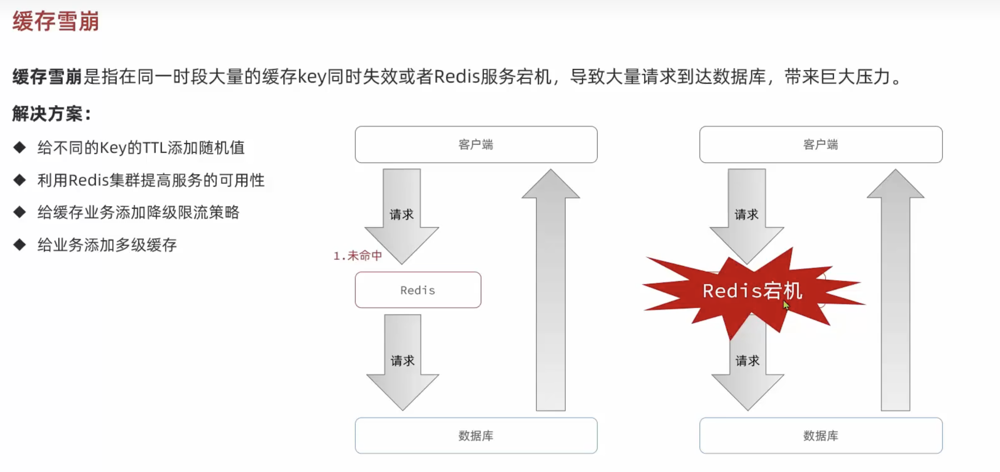
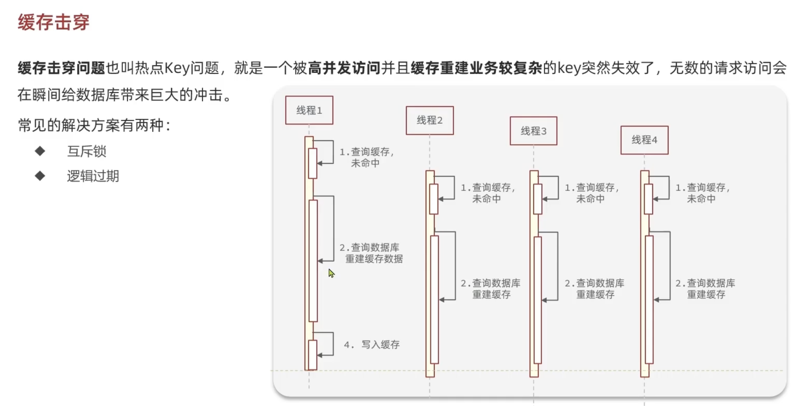
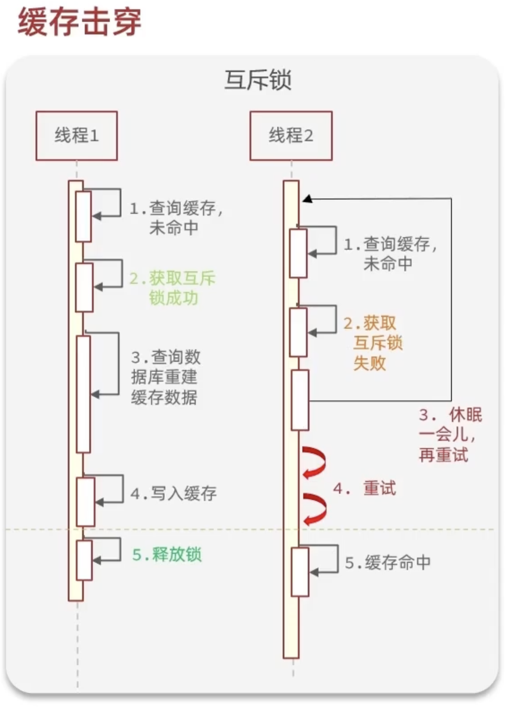
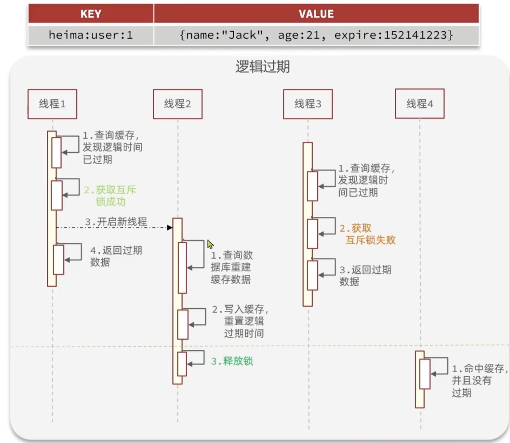
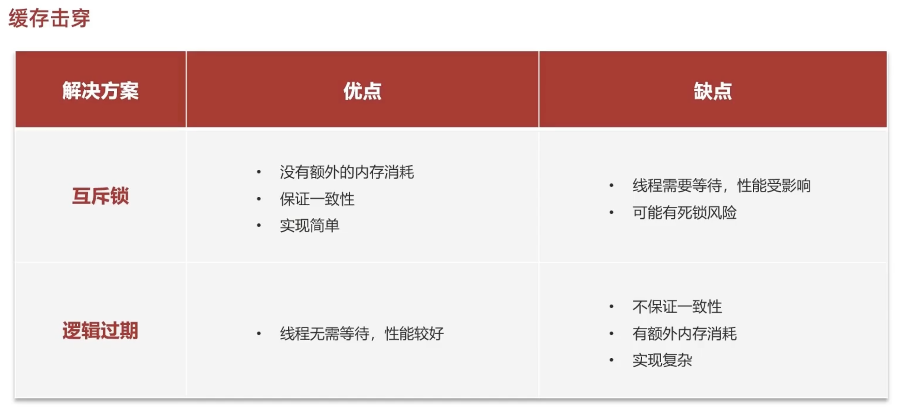
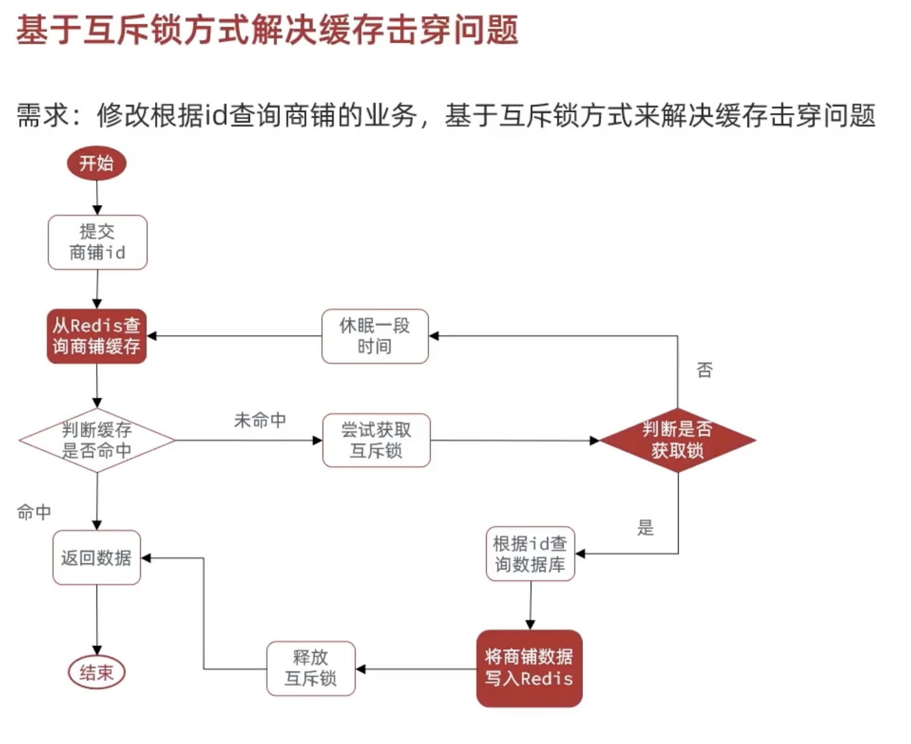
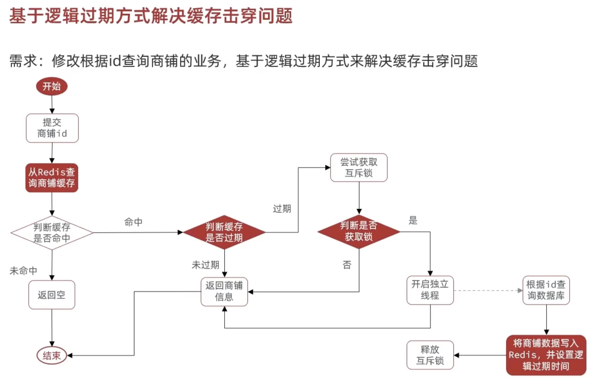

# Redis缓存实现

## 添加Redis缓存


### 商家缓存的实现

#### 实现类代码

```java
@Service
public class ShopServiceImpl extends ServiceImpl<ShopMapper, Shop> implements IShopService {
    @Resource
    private StringRedisTemplate stringRedisTemplate;

    @Override
    public Result queryById(Long id) {
        //1. search the shop data from redis
        String shopJson = stringRedisTemplate.opsForValue().get(CACHE_SHOP_KEY + id);
        //2. exist or not
        if (StrUtil.isNotBlank(shopJson)) {
            //3. exist => return data
            Shop shop = JSONUtil.toBean(shopJson, Shop.class);
            return Result.ok(shop);
        }
        //4. not exist => search the data from the database
        Shop shop = getById(id);
        //5. not exist => return error
        if (shop == null) {
            return Result.fail("shop not found");
        }
        //6. exist => store in the redis
      stringRedisTemplate.opsForValue().set(CACHE_SHOP_KEY + id, JSONUtil.toJsonStr(shop));
				//7. return shop
        return Result.ok(shop);
    }
}
```

注意一些点：

- 从 Redis 取出的数据是字符串，要转换成 Java 对象（代码可能要shop.getName()），所以有如下代码

  ```java
  Shop shop = JSONUtil.toBean(shopJson, Shop.class);
  ```

- 因为用的是opsForValue()，所以需要把从数据库找到的shop（type：Shop）转为json格式存入Redis中，所以有JSONUtil.toJsonStr(shop)

- ```java
  stringRedisTemplate.opsForValue().set(CACHE_SHOP_KEY + id, JSONUtil.toJsonStr(shop));
  ```


## 缓存的一致性问题

**如果数据库更新了缓存没更新怎么办 or 如果缓存被改写了数据库没更新怎么办？**

 

### 主动更新策略

Write Behind Caching Pattern

调用者之操作缓存数据，**有线程专门异步的将缓存数据持久化道数据库** => 保持了一致性

Cache Aside Pattern（常用）：

在更新数据库的同时更新缓存


先删缓存还是先updata数据库都ok，但是要注意不同线程导致得到的数据不对（回忆OS课中，并行线程执行是穿插进行的）

### 超时剔除和主动更新的实现


####  超时剔除

只需要把源代码

```java
 stringRedisTemplate.opsForValue().set(CACHE_SHOP_KEY + id, JSONUtil.toJsonStr(shop));
```

改成

```java
  stringRedisTemplate.opsForValue().set(CACHE_SHOP_KEY + id, JSONUtil.toJsonStr(shop),CACHE_SHOP_TTL, TimeUnit.MINUTES);
```

就行，**其中CACHE_SHOP_TTL是常量30L**

#### 主动更新

```java
    @Override
    public Result update(Shop shop) {
        Long id = shop.getId();
        if (id == null) {
            return Result.fail("shop id is null");
        }
        //1. update database
        updateById(shop);
        //2. delete cache
        stringRedisTemplate.delete(CACHE_SHOP_KEY + id);

        return Result.ok(shop);
    }
```


## 缓存穿透（Cache Penetration）


### 解决：

#### 1.缓存空对象

#### 2.布隆过滤

#### 

### 解决缓存穿透实现（缓存空值）



**源代码：**

```java
        //4. not exist => search the data from the database
        Shop shop = getById(id);
        //5. not exist => return error
        if (shop == null) {
            return Result.fail("shop not found");
        }
```

**防止缓存穿透：**

```java
        //determine if the value is null or not(avoid the Cache Penetration)
        if (shopJson != null) {
            return Result.fail("Reject query shop");
        }
        //4. not exist => search the data from the database
        Shop shop = getById(id);
        //5. not exist => return error
        if (shop == null) {
            stringRedisTemplate.opsForValue().set(CACHE_SHOP_KEY + id,"",CACHE_NULL_TTL, TimeUnit.MINUTES);
            return Result.fail("shop not found");
        }
```


## 缓存雪崩（**Cache Avalanche**）



## 缓存击穿（Cache Breakdown）



### 解决：

#### 互斥锁

#### 

#### 逻辑过期

不加TTL而是加一个expire的字段（**实际永不过期了**）



### 方案优缺点



### 解决缓存击穿实现（互斥锁）



*Question：怎么实现自定义的锁？*

*Answer：用setnx*

#### setnx用法 

##### ✅ 一句话解释：

> **`SETNX` 是 Redis 提供的“如果 key 不存在才设置”命令**，常用于**加锁**场景。

##### `SETNX` 是 `SET if Not eXists` 的缩写。

------

##### ✅ 最基本用法：

##### 语法：

```bash
SETNX lock_key "locked"
```

- 如果 `lock_key` 不存在，则设置成功，返回 `1`（即：**加锁成功**）
- 如果已经存在，返回 `0`（**加锁失败，别人已经持有锁**）

比如：

```yara
//某个人给名为lock的key赋值1
setnx lock 1
//返回true
return : 1
//突然又来一个人给lock赋值2
setnx lock 2
//返回false
return : 0
```

:::important

✅ **为什么 `SETNX` 可以作为互斥锁？**

:::

我们来从**互斥锁的本质出发**，再结合 Redis 的行为机制，通俗+专业地解释 👇

------

##### ✅ 一、什么是互斥锁？

先搞清楚概念：

> **互斥锁（Mutex）** 的目的是：**同一时间，只允许一个线程/进程执行关键代码区。**

如果锁已经被别人拿走了，别人就得“等”或者“退出”。

------

##### ✅ 二、SETNX 的特性

Redis 的 `SETNX`（或 `SET key value NX`）有个非常关键的特性：

> 只有 **key 不存在时才能设置成功**，设置成功返回 1，否则返回 0。

这就意味着：

🟢 第一个线程成功 set 进去，相当于**获得了锁**
 🔴 后续线程 set 失败，相当于**被拒之门外**

------

##### ✅ 三、用一张图解释：

假设多个线程并发执行：

| 时间点 | 线程A执行               | 线程B执行         | Redis中的key状态             |
| ------ | ----------------------- | ----------------- | ---------------------------- |
| T1     | A 尝试 SETNX lock       | -                 | 成功，返回1，创建了 key=lock |
| T2     | -                       | B 尝试 SETNX lock | 失败，返回0，说明“被锁住”了  |
| T3     | A 处理业务中...         | B 等待/失败/重试  | key 仍存在                   |
| T4     | A 执行完成，DEL lock    | -                 | 锁释放了                     |
| T5     | B 重试，SETNX lock 成功 | -                 | B 成功加锁                   |

🎯 这个流程就完全等价于“加锁 → 执行任务 → 解锁”的互斥操作。

#### 代码实现

```java
    @Override
    public Result queryById(Long id) {
        //2.互斥锁解决缓存击穿
        Shop shop = queryWithMutex(id);
        if (shop == null) {
            return Result.fail("This shot is not found");
        }
        return Result.ok(shop);
    }

    public Shop queryWithMutex(Long id) {
        //1. search the shop data from redis
        String shopJson = stringRedisTemplate.opsForValue().get(CACHE_SHOP_KEY + id);
        //2. exist or not
        if (StrUtil.isNotBlank(shopJson)) {
            //3. exist => return data
            return JSONUtil.toBean(shopJson, Shop.class);
        }
        //determine if the value is null or not(avoid the Cache Penetration)
        if (shopJson != null) {
            return null;
        }
        //Implement the Mutex function(get lock and del lock)
        // Get the lock
        String lockKey = LOCK_SHOP_KEY + id;
        Shop shop = null;
        try {
            boolean isLock = tryLock(lockKey);
            // Determine if getting lock successfully
            //can not get lock => wait
            if (!isLock) {
                Thread.sleep(50);
                return queryWithMutex(id);
            }
            // get lock => do the action: 1.get data from dataset 2.transmission data to Redis 3. return data
            //4. not exist => search the data from the database
            shop = getById(id);
            //5. not exist => return error
            if (shop == null) {
                stringRedisTemplate.opsForValue().set(CACHE_SHOP_KEY + id,"",CACHE_NULL_TTL, TimeUnit.MINUTES);
                return null;
            }
            //6. exist => store in the redis
            stringRedisTemplate.opsForValue().set(CACHE_SHOP_KEY + id, JSONUtil.toJsonStr(shop),CACHE_SHOP_TTL, TimeUnit.MINUTES);
        } catch (InterruptedException e) {
            throw new RuntimeException(e);
        }finally {
            // release lock
            unlock(lockKey);
        }

        return shop;
    }

    private boolean tryLock(String key) {
        Boolean flag = stringRedisTemplate.opsForValue().setIfAbsent(key, "1", LOCK_SHOP_TTL, TimeUnit.MINUTES);
        return BooleanUtil.isTrue(flag);
    }

    private boolean unlock(String key) {
        Boolean flag = stringRedisTemplate.delete(key);
        return BooleanUtil.isTrue(flag);
    }

```

:::tip

用**JMeter**做缓存击穿模拟或者压力测试

:::


### 解决缓存击穿实现（逻辑过期）

  

#### 主要代码

```java
    @Override
    public Result queryById(Long id) {
        //1.缓存穿透
        // Shop shop = queryWithPassThrough(id);
        //互斥锁解决缓存击穿
//        Shop shop = queryWithMutex(id);
        //用逻辑过期解决缓存击穿
        Shop shop = queryWithLogicalExpire(id);
        if (shop == null) {
            return Result.fail("This shot is not found");
        }
        return Result.ok(shop);
    }    
```

```java
	public Shop queryWithLogicalExpire(Long id) {
        //1. search the shop data from redis
        String shopJson = stringRedisTemplate.opsForValue().get(CACHE_SHOP_KEY + id);
        //2. exist or not
        if (StrUtil.isBlank(shopJson)) {
            //3. not exist => return null
            return null;
        }
        RedisData redisData = JSONUtil.toBean(shopJson, RedisData.class);
        JSONObject data = (JSONObject) redisData.getData();
        Shop shop = JSONUtil.toBean(data, Shop.class);
        LocalDateTime expireTime = redisData.getExpireTime();
        // judge if cache is expired
        if (expireTime.isAfter(LocalDateTime.now())) {
            // if not expired => return shop data
            return shop;
        }
        // if expired => try to get lock
        String lockKey = LOCK_SHOP_KEY + id;
        if (tryLock(lockKey)){
            //if : can get lock => create new thread(using thread pool) to do the update process
            CACHE_REBUILD_EXECUTOR.submit(() -> {
                //update cache
                try {
                    this.saveShop2Redis(id, 20L);
                } catch (Exception e) {
                    throw new RuntimeException(e);
                } finally {
                    unLock(lockKey);
                }
            });
        }
        //if: can not get lock => return shop data(old)

        return shop;
    }
```

```java
    private boolean tryLock(String key) {
        Boolean flag = stringRedisTemplate.opsForValue().setIfAbsent(key, "1", LOCK_SHOP_TTL, TimeUnit.MINUTES);
        return BooleanUtil.isTrue(flag);
    }

    private boolean unLock(String key) {
        Boolean flag = stringRedisTemplate.delete(key);
        return BooleanUtil.isTrue(flag);
    }
```

其中*saveShop2Redis*代码为

```java
    private void saveShop2Redis(Long id, Long expireSeconds) {
        //1.查询店铺数据
        Shop shop = getById(id);
        //2.封装逻辑过期时间
        RedisData redisData = new RedisData();
        redisData.setData(shop);
        redisData.setExpireTime(LocalDateTime.now().plusSeconds(expireSeconds));
        //3.将RedisData类型的data写入Redis（无TTL，逻辑上有过期时间）
        stringRedisTemplate.opsForValue().set(CACHE_SHOP_KEY + id, JSONUtil.toJsonStr(redisData));
    }
```

**其中Redisdata是一个将Object对象（在这里是Shop类对象）以及expireTime属性组合起来的新class**

```java
@Data
public class RedisData {
    private LocalDateTime expireTime;
    private Object data;
}
```

