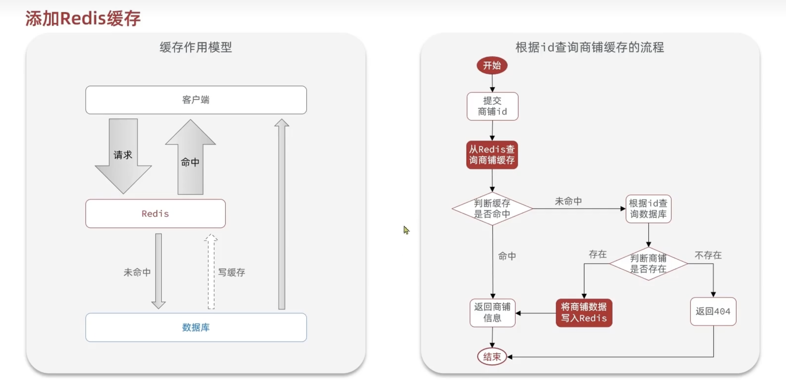
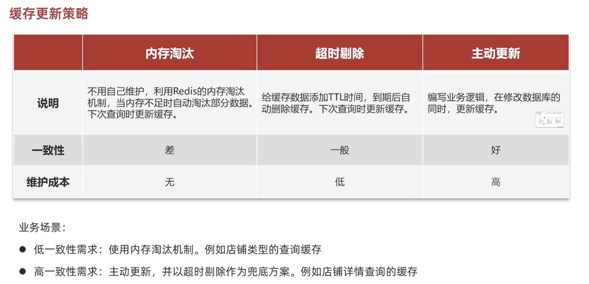
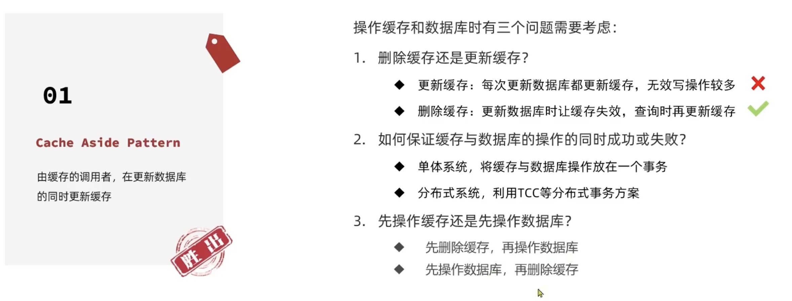
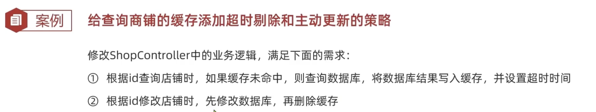
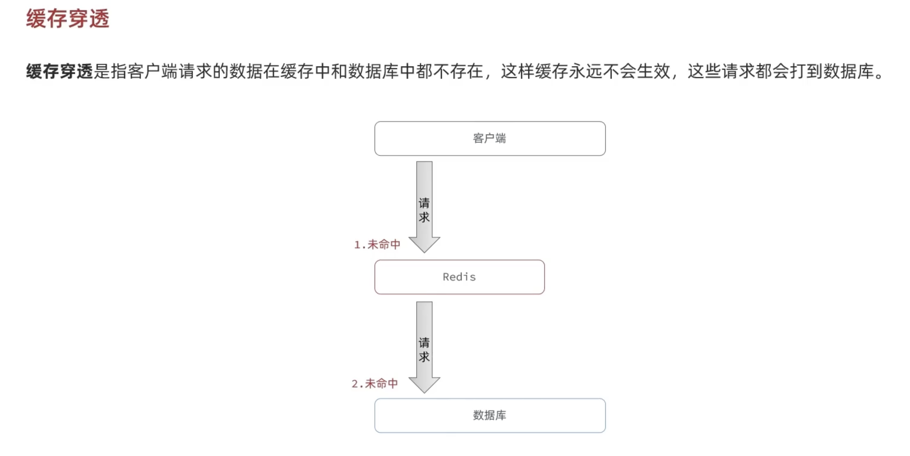

# Redis缓存实现

## 添加Redis缓存



### 商家缓存的实现

#### 实现类代码

```java
@Service
public class ShopServiceImpl extends ServiceImpl<ShopMapper, Shop> implements IShopService {
    @Resource
    private StringRedisTemplate stringRedisTemplate;

    @Override
    public Result queryById(Long id) {
        //1. search the shop data from redis
        String shopJson = stringRedisTemplate.opsForValue().get(CACHE_SHOP_KEY + id);
        //2. exist or not
        if (StrUtil.isNotBlank(shopJson)) {
            //3. exist => return data
            Shop shop = JSONUtil.toBean(shopJson, Shop.class);
            return Result.ok(shop);
        }
        //4. not exist => search the data from the database
        Shop shop = getById(id);
        //5. not exist => return error
        if (shop == null) {
            return Result.fail("shop not found");
        }
        //6. exist => store in the redis
      stringRedisTemplate.opsForValue().set(CACHE_SHOP_KEY + id, JSONUtil.toJsonStr(shop));
				//7. return shop
        return Result.ok(shop);
    }
}
```

注意一些点：

- 从 Redis 取出的数据是字符串，要转换成 Java 对象（代码可能要shop.getName()），所以有如下代码

  ```java
  Shop shop = JSONUtil.toBean(shopJson, Shop.class);
  ```

- 因为用的是opsForValue()，所以需要把从数据库找到的shop（type：Shop）转为json格式存入Redis中，所以有JSONUtil.toJsonStr(shop)

- ```java
  stringRedisTemplate.opsForValue().set(CACHE_SHOP_KEY + id, JSONUtil.toJsonStr(shop));
  ```


## 缓存的一致性问题

**如果数据库更新了缓存没更新怎么办 or 如果缓存被改写了数据库没更新怎么办？**

 

### 主动更新策略

Write Behind Caching Pattern

调用者之操作缓存数据，**有线程专门异步的将缓存数据持久化道数据库** => 保持了一致性

Cache Aside Pattern（常用）：

在更新数据库的同时更新缓存



先删缓存还是先updata数据库都ok，但是要注意不同线程导致得到的数据不对（回忆OS课中，并行线程执行是穿插进行的）

### 超时剔除和主动更新的实现



####  超时剔除

只需要把源代码

```java
 stringRedisTemplate.opsForValue().set(CACHE_SHOP_KEY + id, JSONUtil.toJsonStr(shop));
```

改成

```java
  stringRedisTemplate.opsForValue().set(CACHE_SHOP_KEY + id, JSONUtil.toJsonStr(shop),CACHE_SHOP_TTL, TimeUnit.MINUTES);
```

就行，**其中CACHE_SHOP_TTL是常量30L**

#### 主动更新

```java
    @Override
    public Result update(Shop shop) {
        Long id = shop.getId();
        if (id == null) {
            return Result.fail("shop id is null");
        }
        //1. update database
        updateById(shop);
        //2. delete cache
        stringRedisTemplate.delete(CACHE_SHOP_KEY + id);

        return Result.ok(shop);
    }
```


## 缓存穿透



### 解决：

#### 1.缓存空对象

#### 2.布隆过滤
