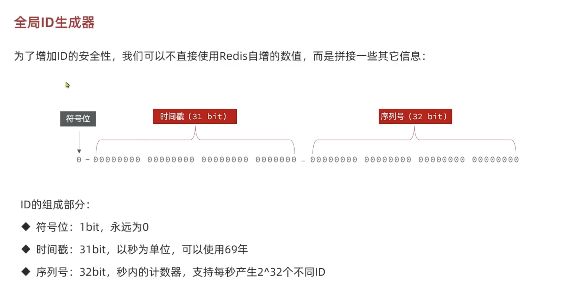
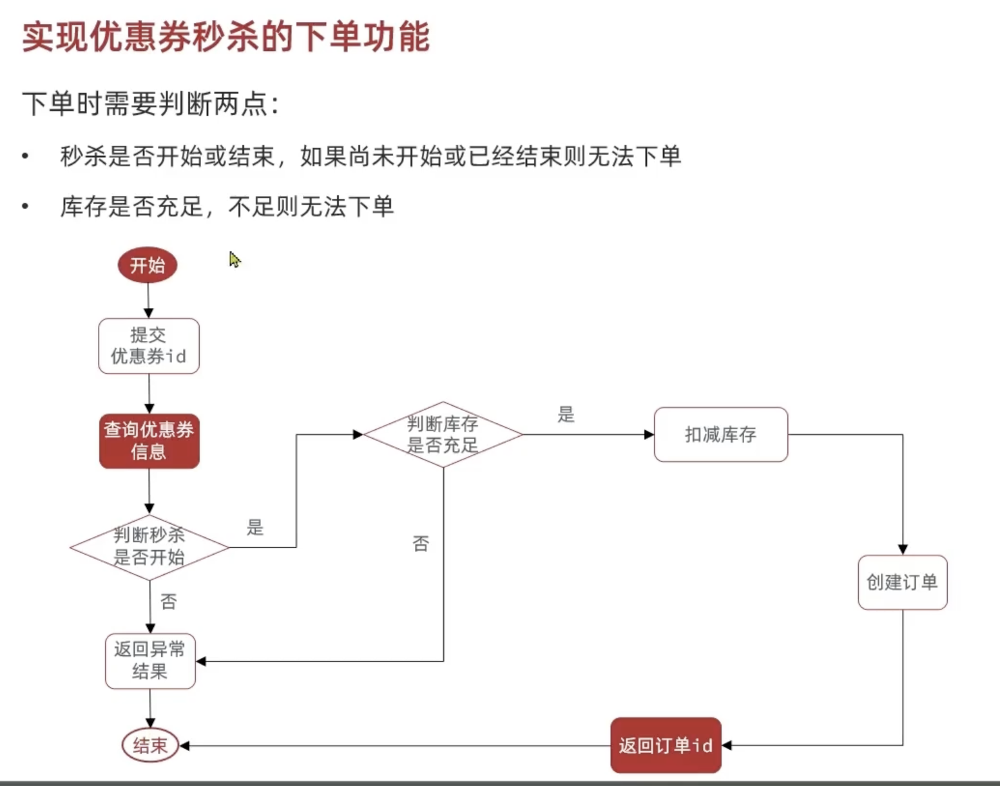
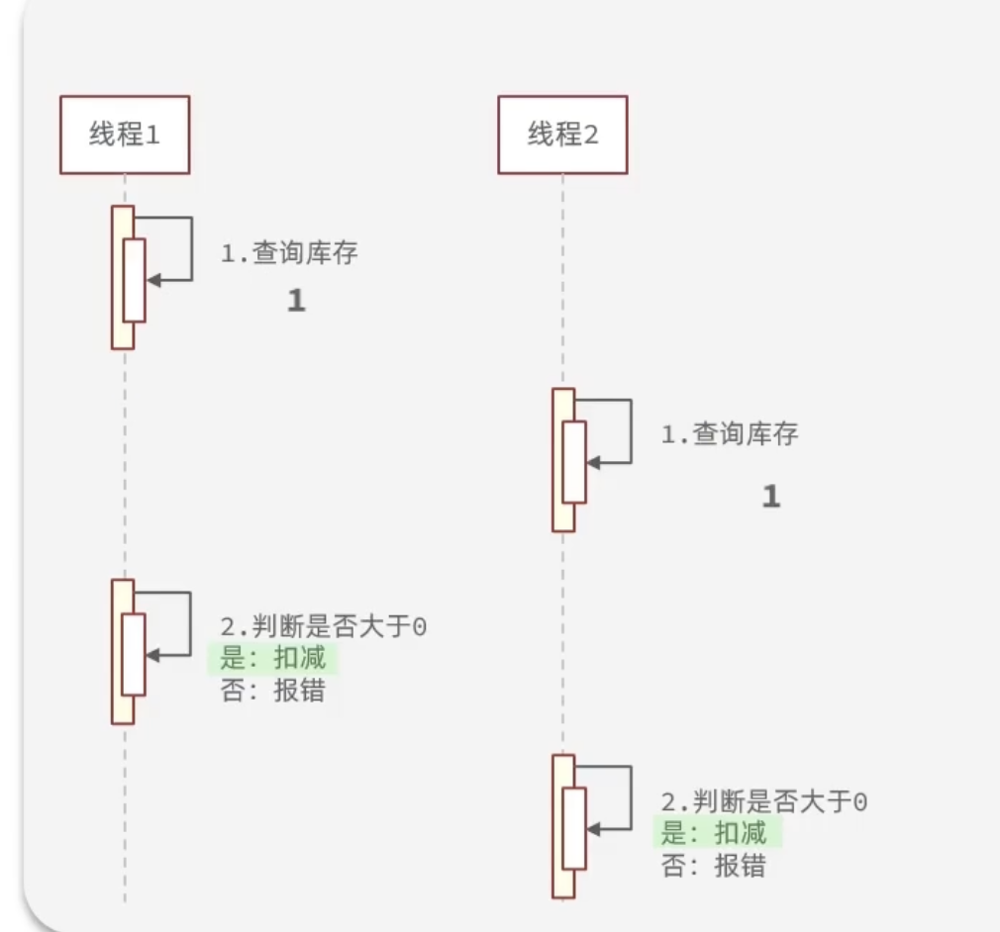
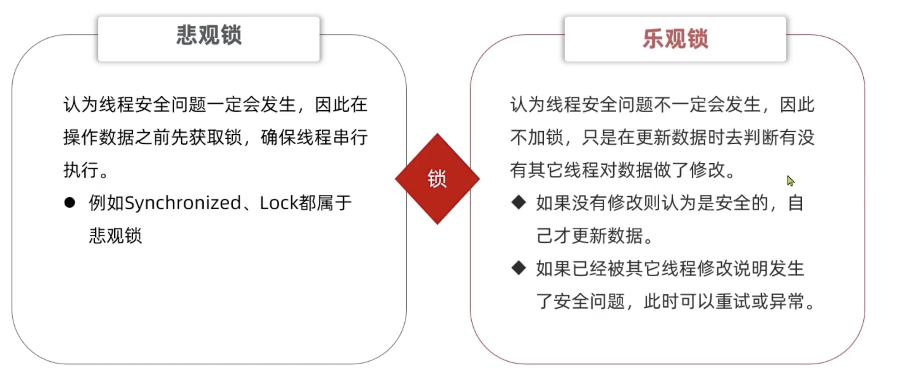
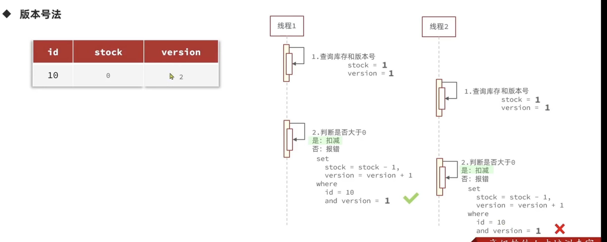
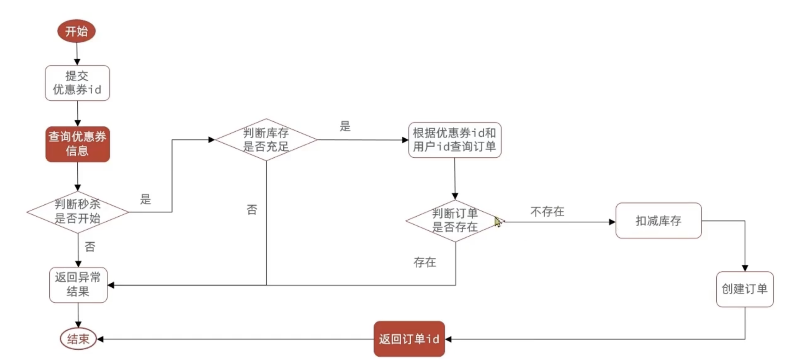
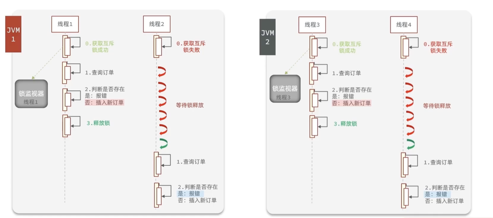

# Redis—Flash Sale

## Redis 生成全局唯一ID



```java
@Component
public class RedisIdWorker {
    private static final long BEGIN_TIMESTAMP = 1640995200L;
    private static final long COUNT_BITS = 32;

    private StringRedisTemplate stringRedisTemplate;

    public RedisIdWorker(StringRedisTemplate stringRedisTemplate) {
        this.stringRedisTemplate = stringRedisTemplate;
    }

    public long nextId(String keyPrefix) {
        //1.生成时间戳
        LocalDateTime now = LocalDateTime.now();
        long nowSecond = now.toEpochSecond(ZoneOffset.UTC);
        long timestamp = nowSecond - BEGIN_TIMESTAMP;
        //2.生成序列号
        //2.1获取当天日期
        String date = now.format(DateTimeFormatter.ofPattern("yyyy:MM:dd"));
        //2.2自增长
        Long count = stringRedisTemplate.opsForValue().increment("icr:" + keyPrefix + ":" + date);
        //3.拼接返回
        return timestamp << COUNT_BITS | count;
    }

    public static void main(String[] args) {
        LocalDateTime time = LocalDateTime.of(2022, 1, 1, 0, 0);
        long second = time.toEpochSecond(ZoneOffset.UTC);
        System.out.println(second);

    }
}
```

## Redis实现优惠券秒杀下单

###### 

### 实现类代码

```java
public class VoucherOrderServiceImpl extends ServiceImpl<VoucherOrderMapper, VoucherOrder> implements IVoucherOrderService {
    @Resource
    private ISeckillVoucherService seckillVoucherService;
    @Resource
    private RedisIdWorker redisIdWorker;
    @Override
    @Transactional
    public Result seckillVoucher(Long voucherId) {
        //1.查询优惠券
        SeckillVoucher voucher = seckillVoucherService.getById(voucherId);
        //2.判断：秒杀是否开始
        if (voucher.getBeginTime().isAfter(LocalDateTime.now())) {
            return Result.fail("秒杀未开始");

        }
        //3。判断：秒杀是否结束
        if (voucher.getEndTime().isBefore(LocalDateTime.now())) {
            return Result.fail("秒杀已结束");

        }
        //4.判断：是否充足
        if (voucher.getStock() < 1) {
            return Result.fail("库存不足");
        }
        //5.扣库存
        boolean success = seckillVoucherService.update().
                setSql("stock =  stock - 1 ").
                eq("voucher_id", voucherId).update();
        if (!success) {
            return Result.fail("库存不足");
        }
        //6.创订单
        VoucherOrder voucherOrder = new VoucherOrder();
        long orderID = redisIdWorker.nextId("order");
        voucherOrder.setId(orderID);
        Long userID = UserHolder.getUser().getId();
        voucherOrder.setUserId(userID);
        voucherOrder.setVoucherId(voucherId);
        save(voucherOrder);
        //7.返回订单id
        return Result.ok(orderID);
    }
}
```

注意，在这段代码中我们用了**事务**来保证该功能扣库存等流程等安全

```java
@Override
@Transactional //注入事务
public Result seckillVoucher(Long voucherId) {
    // 事务中的所有数据库操作
}
```

## 库存超卖问题

**高并发的场景下可能出现超卖现象**

### 为什么

######  

### 解决方法



#### 乐观锁流程

##### 方法一：版本号法



关键点是在最后进行set .... where ....操作时，where处检查了version的版本号是否与之前是相同的： 如果不同则说明数据已经被修改了，所以就做不了减库存的操作了

##### 方法二：CAS法（Compare and Set）

这个方法与版本号的区别是，因为我们发现库存是变化的，这使得库存与版本号的作用是一样的，那么直接就判断**更改时的库存与直接我查到的库存是否一样**就可以了

#### 代码实现

```java
    boolean success = seckillVoucherService.update().
            setSql("stock =  stock - 1 ").
            eq("voucher_id", voucherId).eq("stock", voucher.getStock()).update();
    if (!success) {
        return Result.fail("库存不足");
    }
```

和源代码相比较

```java
    boolean success = seckillVoucherService.update().
            setSql("stock =  stock - 1 ").
            eq("voucher_id", voucherId).update();
    if (!success) {
        return Result.fail("库存不足");
    }
```

多了.eq("stock", voucher.getStock())这一条，让它在最后更改库存时候判断stock的值是不是和我得到voucher.getStock()的值相同

#### 乐观锁弊端

乐观锁导致，只要库存数与之前自己查到的库存数不同，则判断接下来的动作不能执行。这导致：**可能出现在-1后仍然有库存的情况下，不能进行库存减少动作**（乐观锁不会管你-1后还有没有库存的，只要库存数和自己查到的不一样，就不会做后面的动作）

##### 改进

```java
        boolean success = seckillVoucherService.update().
                setSql("stock =  stock - 1 ").
                eq("voucher_id", voucherId).gt("stock", 0).update();
        if (!success) {
            return Result.fail("库存不足");
        }
```

我不让它判断库存是否等于voucher.getStock()，而是只要它“where id = ？ and stock > 0”即可执行接下来的操作（.gt("stock", 0).update();）


## 实现一人一单功能



```java
        Long userID = UserHolder.getUser().getId();
        int count = query().eq("user_id", userID).eq("voucher_id", voucherId).count().intValue();
        if (count > 0) {
            return Result.fail("This user is already voucher");
        }
```

### 问题

一个用户进行高并发购买操作时，**多线程**导致查到的count可能很多次都是0，导致一个用户可以下多个单

### 解决方法

因为这里判断的时是否存在而非是否修改过，所以我们只能用悲观锁

```java
    @Transactional
    public Result createVoucherOrder(Long voucherId) {
        //实现一人一单功能
        Long userID = UserHolder.getUser().getId();
        synchronized(userID.toString().intern()) {
            int count = query().eq("user_id", userID).eq("voucher_id", voucherId).count().intValue();
            if (count > 0) {
                return Result.fail("This user is already voucher");
            }
            //5.扣库存
            boolean success = seckillVoucherService.update().
                    setSql("stock =  stock - 1 ").
                    eq("voucher_id", voucherId).gt("stock", 0).update();
            if (!success) {
                return Result.fail("库存不足");
            }
            //6.创订单
            VoucherOrder voucherOrder = new VoucherOrder();
            long orderID = redisIdWorker.nextId("order");
            voucherOrder.setId(orderID);

            voucherOrder.setUserId(userID);
            voucherOrder.setVoucherId(voucherId);
            save(voucherOrder);
            //7.返回订单id
            return Result.ok(orderID);
        }
    }
}
```

这里的逻辑是：我们把从一人一单--->创建订单这个流程分装成一个function

为了实现对于**同一个用户加锁，对于不同用户不用加锁**：我们在方法中对于**一人一单--->创建订单**这个流程进行加锁，而不是对于整个方法加锁

```java
 synchronized(userID.toString().intern()) {
 ............
 }
```

这里的intern()保证了在userID相同的情况下，这个对象就是同一个对象（因为toString的底层其实还是new 一个对象，所以即使userID相同，也不是一个对象）


### 仍然存在的问题与解决方案

因为这个锁是在function内部，那么执行完这个function这个锁就释放了。但是注意，此时这个事务可能还没有提交！这就导致之前被堵住的线程在这时候进行订单查询还可能查到没有订单的情况。

所以解决方案是：

```java
        Long userID = UserHolder.getUser().getId();

        synchronized(userID.toString().intern()) {
            return createVoucherOrder(voucherId);
        }
```

当调用我们封装好的createVoucherOrder函数时加锁，因为createVoucherOrder有@transactional注解，所以当这个事务彻底提交后，锁才会被释放


## 集群下的锁失效

上述的锁只有在一个服务器上有效，但是当我们部署到多个服务器做负载均衡，synchronized会失效！！ 



### 如何解决

分布式锁！见下一章
