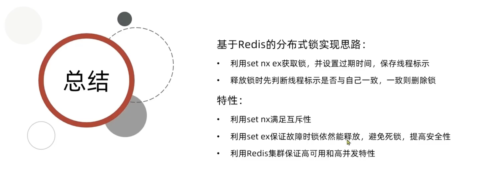

# Redis—**Distributed Lock**


**关键点**：让多个JVM看到同一个锁监视器

Redis是JVM外部的，所以可以实现分布式锁


## Redis分布式锁原理

Redis用SETNX来实现锁（新建了一个key，而且这个key只能存在一个）

比如

```bash
SETNX lock thread1
```

在线程1上创建一个key = lock 的关键字

```bash
EXPIRE lock 5
```

用EXPIRE来设置TTL

**为了保证原子性，需要让SETNX和EXPIRE同时进行**，通过用Redis中SET命令

```bash
SET lock thread1 EX 10 NX 
```

 NX是互斥，EX是设置超时时间


## Redis实现分布式锁初级版本


主要流程就是

用**StringRedisTemplate**来做获取锁操作

注意：锁的名字不能固定（不能像上面一样都取名为lock，不然不同业务都用同一个锁了）

```java
public class SimpleRedisLock implements ILock {
    private String name;
    private StringRedisTemplate stringRedisTemplate;
    private static final String KEY_PREFIX = "lock:";
    public SimpleRedisLock(String name, StringRedisTemplate stringRedisTemplate) {
        this.name = name;
        this.stringRedisTemplate = stringRedisTemplate;
    }
    @Override
    public boolean tryLock(long timeoutSec) {
        //获取线程ID
        long threadId = Thread.currentThread().getId();
        //threadId + ""：long -> String
        Boolean success = stringRedisTemplate.opsForValue().setIfAbsent(KEY_PREFIX + name, threadId + "", timeoutSec, TimeUnit.SECONDS);

        return Boolean.TRUE.equals(success);
    }

    @Override
    public void unlock() {
        stringRedisTemplate.delete(KEY_PREFIX + name);
    }
}

```

这样，在代码中我们可以这样使用

```java
       Long userID = UserHolder.getUser().getId();
        SimpleRedisLock lock = new SimpleRedisLock("order" + userID, stringRedisTemplate);
        boolean isLock = lock.tryLock(1200);
        if(!isLock){
            //fail to get lock
            return Result.fail("only one order per customer");
        }
        try {
            IVoucherOrderService proxy = (IVoucherOrderService) AopContext.currentProxy();
            return proxy.createVoucherOrder(voucherId);
        }finally {
            lock.unlock();
        }
```


## 初级版本可能存在的问题

 

**线程1 成功获取锁**，开始执行业务逻辑（比如下单）。

但是**线程1 执行业务耗时太久**，超过了 Redis 锁的过期时间（比如设置了 `10s`）。

锁 **自动过期被释放**，这时线程1还没执行完。

**线程2 抢到了锁**，开始执行业务逻辑。

然后线程1的业务完成，**它尝试释放锁**，但是它释放的是“**它认为还属于自己的锁**”。

### 解决流程：


## 改进Redis分布式锁（线程表示：UUID）

```java
public class SimpleRedisLock implements ILock {
    private String name;
    private StringRedisTemplate stringRedisTemplate;
    private static final String KEY_PREFIX = "lock:";
    private static final String ID_PREFIX = UUID.randomUUID().toString() + "-";
    public SimpleRedisLock(String name, StringRedisTemplate stringRedisTemplate) {
        this.name = name;
        this.stringRedisTemplate = stringRedisTemplate;
    }
    @Override
    public boolean tryLock(long timeoutSec) {
        //获取线程ID
        String threadId = ID_PREFIX + Thread.currentThread().getId();
        //threadId + ""：long -> String
        Boolean success = stringRedisTemplate.opsForValue().setIfAbsent(KEY_PREFIX + name, threadId, timeoutSec, TimeUnit.SECONDS);

        return Boolean.TRUE.equals(success);
    }

    @Override
    public void unlock() {
        String threadId = ID_PREFIX + Thread.currentThread().getId();
        String id = stringRedisTemplate.opsForValue().get(KEY_PREFIX + threadId);
        if (threadId.equals(id)){
            stringRedisTemplate.delete(KEY_PREFIX + name);
        }

    }
}
```

**需要注意：判断和删除这两个动作需要有原子性！**所以我们仍然需要修改代码

## Lua脚本保证判断和删除的原子性

**Redis的Lua脚本是：在一个脚本中编写多条Redis命令，保证多条命令执行时候的原子性**

 

### lua脚本实现

```lua
if(redis.call('get', KEYS[1] == ARGV[1])) then
    return redis.call('del',KEYS[1])
end
return 0
```

### 在java中调用

```java
    private static final DefaultRedisScript<Long> UNLOCK_SCRIPT;
    static {
        UNLOCK_SCRIPT = new DefaultRedisScript<>();
        UNLOCK_SCRIPT.setLocation(new ClassPathResource("unloock.lua"));
        UNLOCK_SCRIPT.setResultType(Long.class);
    }
   @Override
    public void unlock() {
        //调用lua脚本
        stringRedisTemplate.execute(
                UNLOCK_SCRIPT, 
                Collections.singletonList(KEY_PREFIX + name),
                ID_PREFIX + Thread.currentThread().getId()
        );

    }
```

### 小结1


