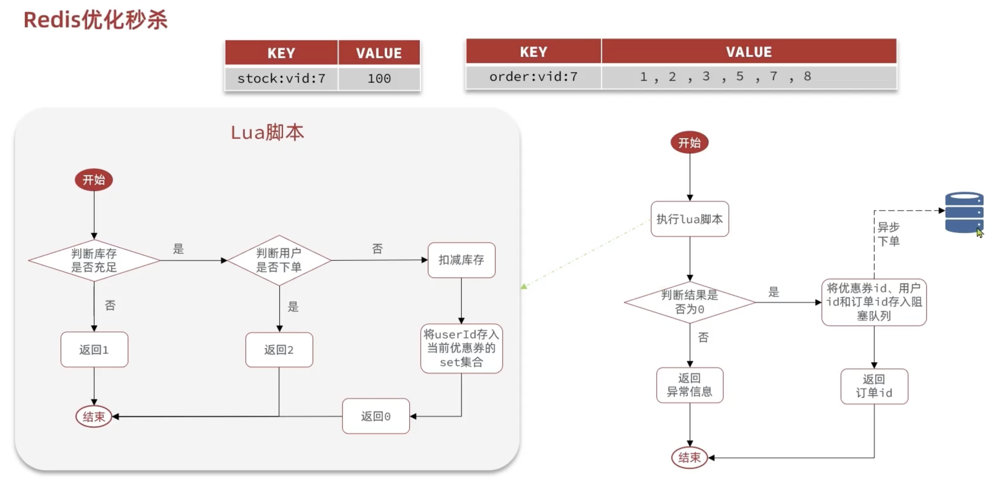

# Redis—Optimization of Flash Sale Functionality

## 为什么需要优化以及优化逻辑

**因为秒杀业务中太多对数据库的操作了，在高并发的时候效率一般（用JMeter模拟1000个用户同时请求秒杀活动得出）**


## 优化逻辑

主线程主要是用做判断这个用户有没有购买秒杀资格，如果有资格----->我们新开一个线程来做比较耗时的查询，减库存，创建订单等操作

**总的来说，就是把对数据库同步的写操作，变成了异步的写操作**

## 如何用Redis判断是否有资格购买



用Hash来存库存和订单，其中，订单等用户ID Value可以用Set集合来存储，保证了一个用户只能买一次（唯一性）

并且，为了确保这个流程的原子性，可以用Lua脚本执行这个过程

## 优化流程

### 新增优惠券时 将优惠券信息同时保存到Redis中

```java
    @Resource
    private ISeckillVoucherService seckillVoucherService;
    @Resource
    private StringRedisTemplate stringRedisTemplate;
    
    @Override
    @Transactional
    public void addSeckillVoucher(Voucher voucher) {
        // 保存优惠券
        save(voucher);
        // 保存秒杀信息
        SeckillVoucher seckillVoucher = new SeckillVoucher();
        seckillVoucher.setVoucherId(voucher.getId());
        seckillVoucher.setStock(voucher.getStock());
        seckillVoucher.setBeginTime(voucher.getBeginTime());
        seckillVoucher.setEndTime(voucher.getEndTime());
        seckillVoucherService.save(seckillVoucher);
        // 保存秒杀信息到Redis中 *新增代码*
        stringRedisTemplate.opsForValue().set(SECKILL_STOCK_KEY + voucher.getId(), voucher.getStock().toString());
    }
```

### 基于lua脚本判断秒杀库存与一人一单，判断是否抢购成功

```lua
-- 1. parameters list: voucher id, user id
local voucherId = ARGV[1]
local userId = ARGV[2]
-- 2. stockKey and orderKey
local stockKey = 'seckill:stock:' .. voucherId
local orderKey = 'seckill:order:' .. voucherId

if (tonumber(redis.call('get', stockKey)) <= 0) then
    return 1
end

if (redis.call('sismember', orderKey, userId) == 1) then
    return 2
end

redis.call('incrby', stockKey, -1)
redis.call('sadd', orderKey, userId)

return 0
```

写好lua脚本后我们更改java业务逻辑

```java
   private static final DefaultRedisScript<Long> SECKIll_SCRIPT;
    static {
        SECKIll_SCRIPT = new DefaultRedisScript<>();
        SECKIll_SCRIPT.setLocation(new ClassPathResource("seckill.lua"));
        SECKIll_SCRIPT.setResultType(Long.class);
    }
    @Override
    public Result seckillVoucher(Long voucherId) {
        //获取用户
        Long userId = UserHolder.getUser().getId();
        //1.执行lua脚本
        Long result = stringRedisTemplate.execute(
                SECKIll_SCRIPT,
                Collections.emptyList(),
                voucherId.toString(),
                userId.toString()
        );
        //2.判断return 是否 0
        int r = result.intValue();
        if (r != 0){
            //2.1 非0 -> 无资格
            return Result.fail(r == 1 ? "库存不足" : "用户一人一单");
        }
            //2.2 0 -〉可以购买
        long orderId = redisIdWorker.nextId("order");
        //TODO 保存阻塞队列

        //返回order id
        return Result.ok(orderId);

    }
```

原来的业务逻辑

```java
    @Override
    public Result seckillVoucher(Long voucherId) {
        //1.查询优惠券
        SeckillVoucher voucher = seckillVoucherService.getById(voucherId);
        //2.判断：秒杀是否开始
        if (voucher.getBeginTime().isAfter(LocalDateTime.now())) {
            return Result.fail("秒杀未开始");

        }
        //3。判断：秒杀是否结束
        if (voucher.getEndTime().isBefore(LocalDateTime.now())) {
            return Result.fail("秒杀已结束");

        }
        //4.判断：是否充足
        if (voucher.getStock() < 1) {
            return Result.fail("库存不足");
        }
        Long userID = UserHolder.getUser().getId();
        //分布式锁
//      SimpleRedisLock lock = new SimpleRedisLock("order" + userID, stringRedisTemplate);
        RLock lock = redissonClient.getLock("lock:order:" + userID);
        boolean isLock = lock.tryLock();
        if(!isLock){
            //fail to get lock
            return Result.fail("only one order per customer");
        }
        try {
            IVoucherOrderService proxy = (IVoucherOrderService) AopContext.currentProxy();
            return proxy.createVoucherOrder(voucherId);
        }finally {
            lock.unlock();
        }
    }
```

#### 为什么不再需要分布式锁？

之前的业务逻辑中，**用户是否下过单、库存是否足够的判断 + 扣库存 + 下单** 是分步骤进行的，这样存在并发问题，必须用锁控制：

```java
//1. 判断是否秒杀开始
//2. 判断是否库存充足
//3. 判断用户是否下过单
//4. 扣库存
//5. 下单
```

这些步骤如果拆开执行，在高并发下就可能出问题，比如：

- 多个线程几乎同时判断“库存充足”，然后同时去扣库存，超卖了；
- 多个线程同时判断“用户没下单”，然后同时插入订单，造成**一人多单**。

------

而现在，你将这些逻辑封装到一个 **Redis Lua 脚本** 中：

```lua
-- seckill.lua 示例逻辑（伪代码）：
if (库存 <= 0) then return 1 end
if (用户已下单) then return 2 end
库存 -= 1
记录用户已下单
return 0
```

这段脚本是 **原子执行的**（Redis 保证 Lua 脚本执行期间单线程、无并发），因此不会出现竞态条件，所以：

> **这比 Redisson 锁更加高效且安全**，因为你避免了 Java 层锁的开销和复杂度。

### 把下单信息保存到阻塞队列里面

```java
    private BlockingQueue<VoucherOrder> orderTasks = new ArrayBlockingQueue<>(1024*1024);
    public Result seckillVoucher(Long voucherId) {
    .......
        //保存阻塞队列
        VoucherOrder voucherOrder = new VoucherOrder();
        long orderID = redisIdWorker.nextId("order");
        voucherOrder.setId(orderID);

        voucherOrder.setUserId(userId);
        voucherOrder.setVoucherId(voucherId);
        orderTasks.add(voucherOrder);
        //返回order id
        return Result.ok(orderId);
    }
```

把下单信息保存到阻塞队列后，我们需要创建新的线程来执行对于数据库的IO操作

### 用心的线程异步执行阻塞队列里对数据库的IO操作

上面已经用` orderTasks.add(voucherOrder);`把这个订单信息放在阻塞队列了
所以我们可以用线程池来创建新线程执行阻塞队列中创建订单的操作

```java
    //线程池创建
    private static final ExecutorService SECKILL_ORDER_EXECUTOR = Executors.newSingleThreadExecutor();
    //线程任务
    //为了让这个class一初始化就开始执行任务，用注解：PostConstruct
    @PostConstruct
    private void init() {
        SECKILL_ORDER_EXECUTOR.submit(new VoucherOrderHandler());
    }
    private class VoucherOrderHandler implements Runnable {
        @Override
        public void run() {
            while (true) {
                try {
                    //获取队列中的订单信息
                    VoucherOrder voucherOder = orderTasks.take();
                    //创建订单
                    handleVoucherOrder(voucherOder);
                } catch (Exception e) {
                    log.error("订单异常", e);
                }
            }
        }
    }

    private void handleVoucherOrder(VoucherOrder voucherOder) {
        Long userId = voucherOder.getUserId();
        RLock lock = redissonClient.getLock("lock:order:" + userId);
        boolean isLock = lock.tryLock();
        if(!isLock){
            //fail to get lock
            log.error("lock 异常");
            return;
        }
        try {
          //之前实现的创建订单的方法，只不过这次穿的是整个订单voucherOder而不是id
            proxy.createVoucherOrder(voucherOder);
        }finally {
            lock.unlock();
        }
    }
```

用**新的线程和阻塞队列**，实现了创建订单的异步操作


**用Redis消息队列来解决**
