# Redis—Redis Queue

## 为什么用消息队列？

JVM的阻塞队列如果在突然崩溃是，阻塞队列中所有信息都会丢失

JVM的阻塞队列在取出信息那一时刻崩溃后，这个取出来的消息会丢失，就永远无法执行了

**Redis优点：**

**Redis在JVM之外，可以保证JVM崩溃是消息队列里面消息安全**

**利用Redis储存，不受限于JVM内存上限**

**Redis有持久化，数据安全**

## Redis消息队列

### 基于List结构

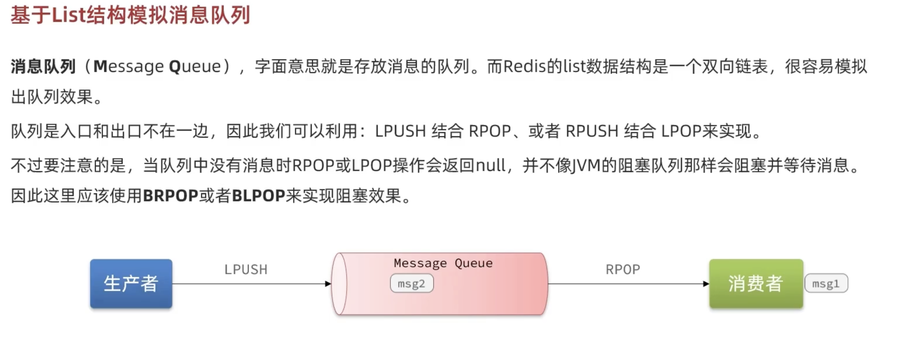

**List缺点：**

**因为用的是BRPOP实现的，所以消息会在拿走后直接被删除，有消息丢失的可能**

**只支持单一的消费值**

### 基于PubSub（Publish&Subscribe）

### 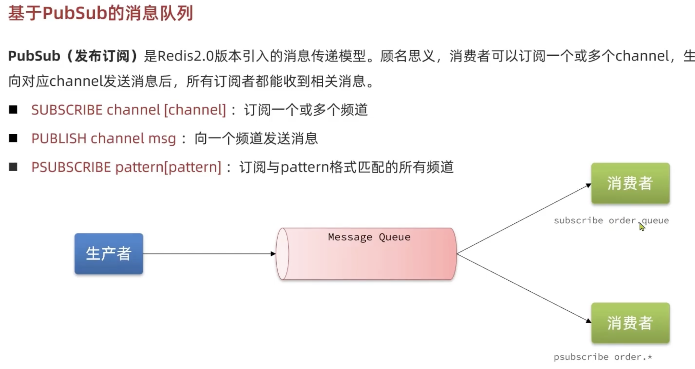

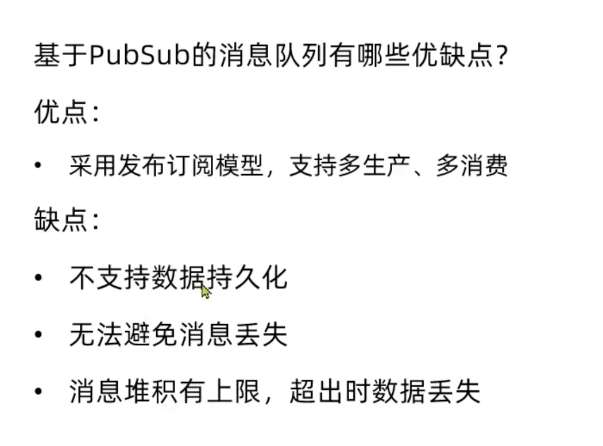

不支持数据持久化：Publish以后没有人subscribe那么消息就丢了

### 基于Stream - 单消费者模式


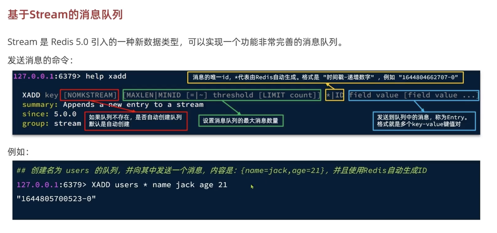

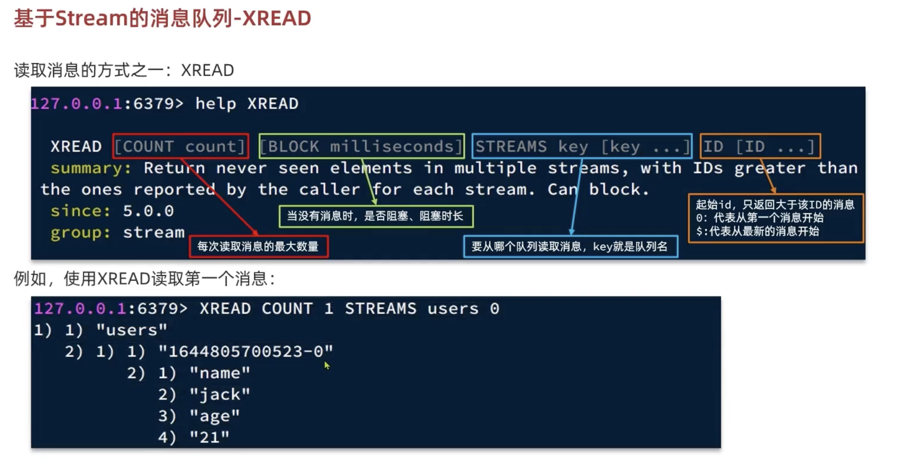

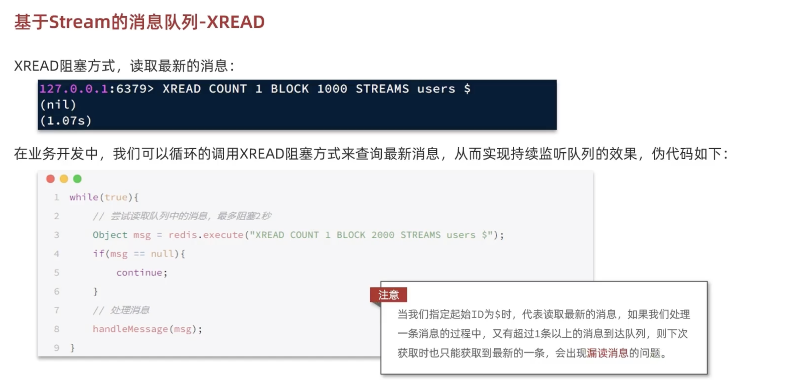


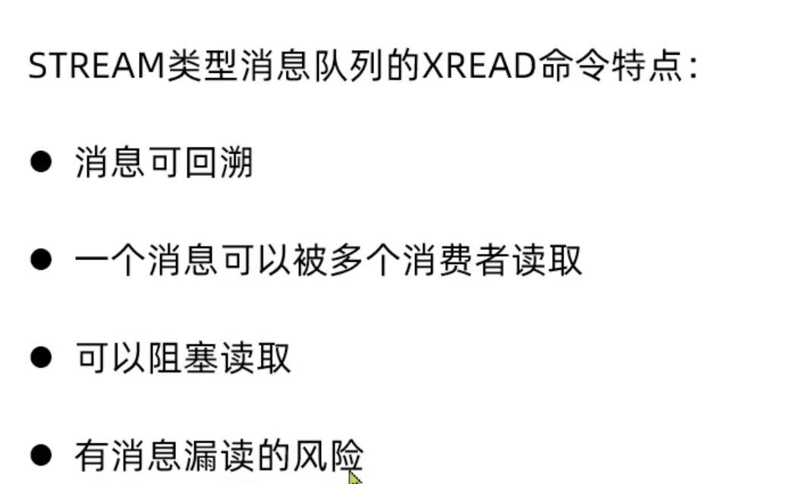

### 基于Stram - 消费者组 （BEST）

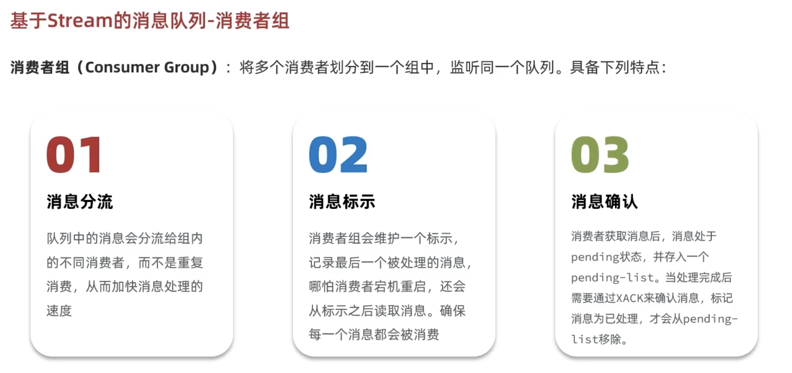

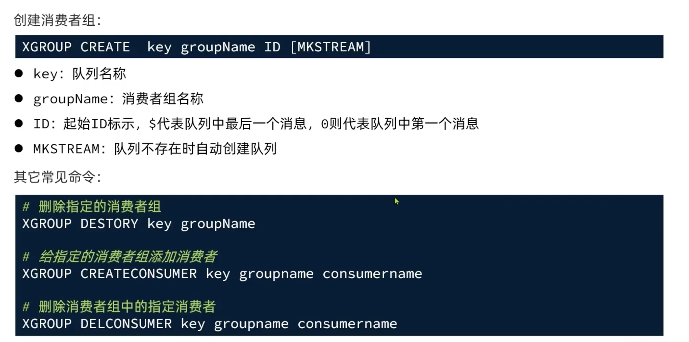

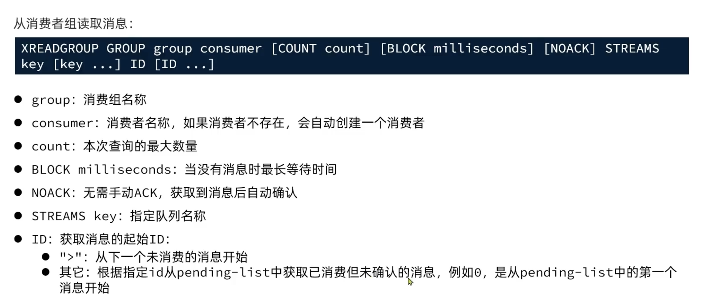

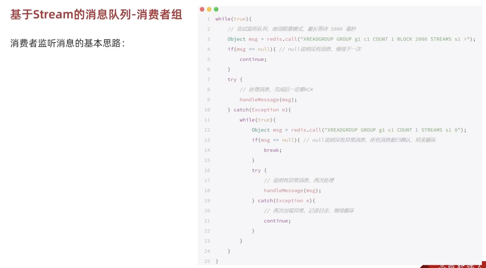

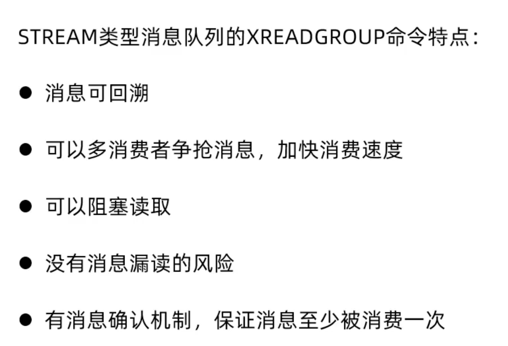

## 基于Stream 的消息队列实现异步秒杀

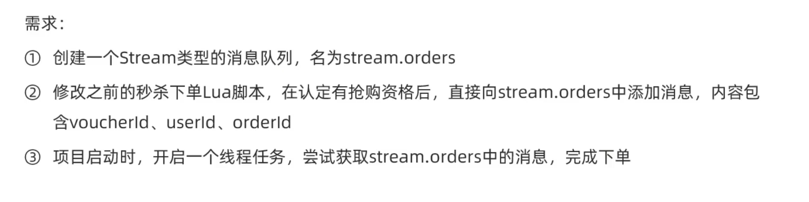

用lua脚本实现创建消息队列

```lua
---
--- Created by shuchangwen.
--- DateTime: 4/18/25 3:20 PM
---
-- 1. parameters list: voucher id, user id
local voucherId = ARGV[1]
local userId = ARGV[2]
local orderId = ARGV[3]
-- 2. stockKey and orderKey
local stockKey = 'seckill:stock:' .. voucherId
local orderKey = 'seckill:order:' .. voucherId

if (tonumber(redis.call('get', stockKey)) <= 0) then
    return 1
end

if (redis.call('sismember', orderKey, userId) == 1) then
    return 2
end

redis.call('incrby', stockKey, -1)
redis.call('sadd', orderKey, userId)

-- 发消到队列
redis.call('xadd', 'stream.orders', '*', 'userId', userId, 'voucherId', voucherId, 'id', orderId)

return 0
```

实现发消息

```java
    @Override
    public Result seckillVoucher(Long voucherId) {
        //获取用户
        Long userId = UserHolder.getUser().getId();
        long orderId = redisIdWorker.nextId("order");
        //1.执行lua脚本
        Long result = stringRedisTemplate.execute(
                SECKIll_SCRIPT,
                Collections.emptyList(),
                voucherId.toString(),
                userId.toString(),
                String.valueOf(orderId)
        );
        //2.判断return 是否 0
        int r = result.intValue();
        if (r != 0){
            //2.1 非0 -> 无资格
            return Result.fail(r == 1 ? "库存不足" : "用户一人一单");
        }
        //  获取代理对象
        proxy = (IVoucherOrderService) AopContext.currentProxy();
        //返回order id
        return Result.ok(orderId);
    }
```

实现收消息

```java
   private class VoucherOrderHandler implements Runnable {
        private String queueName = "stream.orders";
        @Override
        public void run() {
            while (true) {
                try {
                    //获取消息队列中的订单信息
                    List<MapRecord<String, Object, Object>> list = stringRedisTemplate.opsForStream().read(
                            Consumer.from("g1", "c1"),
                            StreamReadOptions.empty().count(1).block(Duration.ofSeconds(2)),
                            StreamOffset.create(queueName, ReadOffset.lastConsumed())
                    );
                    //判断消息是否获取成功
                    if(list == null || list.isEmpty()) {
                        //失败：没有消息则继续下一次循环
                        continue;
                    }
                    //解析消息
                    MapRecord<String, Object, Object> record = list.get(0);
                    Map<Object, Object> values = record.getValue();
                    VoucherOrder voucherOrder = BeanUtil.fillBeanWithMap(values, new VoucherOrder(), true);
                    //成功：创建订单
                    handleVoucherOrder(voucherOrder);
                    //ACK确认
                    stringRedisTemplate.opsForStream().acknowledge(queueName, "g1", record.getId());
                } catch (Exception e) {
                    log.error("订单异常", e);
                    handlePendingList();
                }

            }
        }

        private void handlePendingList() {
            while (true) {
                try {
                    //获取PendingList中的订单信息
                    List<MapRecord<String, Object, Object>> list = stringRedisTemplate.opsForStream().read(
                            Consumer.from("g1", "c1"),
                            StreamReadOptions.empty().count(1),
                            StreamOffset.create(queueName, ReadOffset.from("0"))
                    );
                    //判断消息是否获取成功
                    if(list == null || list.isEmpty()) {
                        //失败：PendingList没有消息则结束
                        break;
                    }
                    //解析消息
                    MapRecord<String, Object, Object> record = list.get(0);
                    Map<Object, Object> values = record.getValue();
                    VoucherOrder voucherOrder = BeanUtil.fillBeanWithMap(values, new VoucherOrder(), true);
                    //成功：创建订单
                    handleVoucherOrder(voucherOrder);
                    //ACK确认
                    stringRedisTemplate.opsForStream().acknowledge(queueName, "g1", record.getId());
                } catch (Exception e) {
                    log.error("订单异常", e);
                }

            }
        }
    }
```

这个和之前的阻塞队列一样，都是用新的线程来执行的

```java
   //线程池创建
    private static final ExecutorService SECKILL_ORDER_EXECUTOR = Executors.newSingleThreadExecutor();
    private volatile boolean running = true;

    @PostConstruct
    private void init() {
        String queueName = "stream.orders";
        String groupName = "g1";

        try {
            stringRedisTemplate.opsForStream().createGroup(queueName, ReadOffset.from("0"), groupName);
            log.info("Redis Stream消费组创建成功：{}", groupName);
        } catch (Exception e) {
            log.info("Redis Stream消费组可能已经存在，无需创建。");
        }

        SECKILL_ORDER_EXECUTOR.submit(new VoucherOrderHandler());
    }
```

