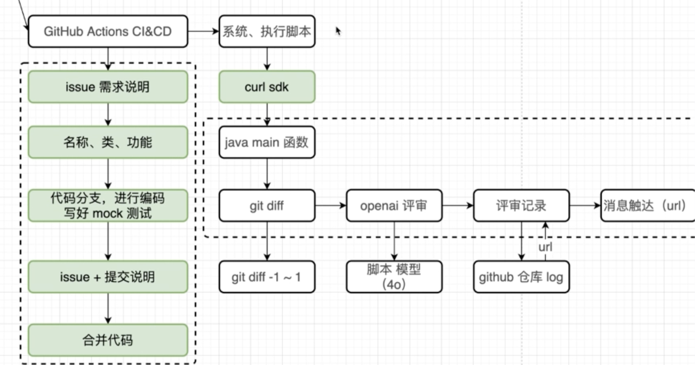

# OverView

## 流程图



## Create GitHub Action Component 

以下是一个用GitHub action运行java代码的示例

```yml
name: Run Java Git Diff By Local

on:
  push:
    branches:
      - '*'
  pull_request:
    branches:
      - '*'

jobs:
  build-and-run:
    runs-on: ubuntu-latest

    steps:
      - name: Checkout repository
        uses: actions/checkout@v2
        with:
          fetch-depth: 2  # 检出最后两个提交，以便可以比较 HEAD~1 和 HEAD

      - name: Set up JDK 11
        uses: actions/setup-java@v2
        with:
          distribution: 'temurin'  # 你可以选择其他发行版，如 'adopt' 或 'zulu'
          java-version: '11'

      - name: Run Java code
        run: |
          cd openai-code-review-sdk/src/main/java
          javac com/github/nanshanvv/sdk/OpenAiCodeReview.java
          java com.github.nanshanvv.sdk.OpenAiCodeReview

```

对于这个项目，我们可以用Maven构建并且执行脚本

```yml
name: Build and Run OpenAiCodeReview By Main Maven Jar

on:
  push:
    branches:
      - main
  pull_request:
    branches:
      - main

jobs:
  build:
    runs-on: ubuntu-latest

    steps:
      - name: Checkout repository
        uses: actions/checkout@v2
        with:
          fetch-depth: 2
      - name: Setup JDK 11
        uses: actions/setup-java@v2
        with:
          distribution: 'adopt'
          java-version: '11'
      - name: Build with Maven
        run: mvn clean install

      - name: Copy openai-code-review-sdk JAR
        run:  mvn dependency:copy -Dartifact=com.github.nanshanvv:openai-code-review-sdk:1.0 -DoutputDirectory=./libs

      - name: Run code Review
        run: java -jar ./libs/openai-code-review-sdk-1.0.jar
```

### ✅ 1. **什么是 JAR 包？我没打过包呀**

**JAR（Java ARchive）包**就是一种 Java 的压缩包格式，本质上和 `.zip` 类似，用于打包一组 `.class` 文件（编译后的 Java 文件）以及资源文件（如 `application.yml`, `log4j.xml` 等），使得 Java 程序可以被更方便地部署和运行。

#### 如果你没手动打过包，那可能是自动打了：

在你的 GitHub Action 里，有这行代码：

```yaml
CopyEdit
- name: Build with Maven
  run: mvn clean install
```

这条命令的默认行为就是：

> 编译 + 测试 + 打包生成 JAR（如果你是个标准 Java 项目，有 `pom.xml` 的话）

所以你虽然没手动 `mvn package`，但 `mvn install` 包含了这一步。

在pom.xml中，有这样的内容

```xml
            <plugin>
                <groupId>org.apache.maven.plugins</groupId>
                <artifactId>maven-jar-plugin</artifactId>
                <version>3.2.0</version>
                <configuration>
                    <archive>
                        <manifest>
                            <addDefaultImplementationEntries>true</addDefaultImplementationEntries>
                            <mainClass>com.github.nanshanvv.sdk.OpenAiCodeReview</mainClass>
                        </manifest>
                    </archive>
                </configuration>
            </plugin>
```

这段配置告诉 Maven：在打包 JAR 时，指定 `com.github.nanshanvv.sdk.OpenAiCodeReview` 为主类，生成一个可以直接执行的 JAR 包，并在 `MANIFEST.MF` 中附带项目元信息。

------

### ✅ 2. **这个流程是干嘛的？为啥要跑 Maven？**

你的 GitHub Actions 是一个自动化工作流：

```yaml
name: Build and Run OpenAiCodeReview By Main Maven Jar
```

它的作用是：

| 步骤                       | 目的                                                    |
| -------------------------- | ------------------------------------------------------- |
| `mvn clean install`        | 构建项目，生成 JAR 包                                   |
| `mvn dependency:copy ...`  | 把指定的 JAR 复制到 `./libs` 文件夹                     |
| `java -jar ./libs/xxx.jar` | 执行这个 JAR 包，开始运行你的程序（比如做自动代码审查） |

也就是说你设置了**每次 push 到 main 分支时**，就自动编译并运行这个 Java 项目。

这种流程叫 **CI（持续集成）+ 自动部署/测试**，适用于：

- 自动代码检查 / 审核
- 自动打包发布
- 自动运行工具脚本（比如你这个代码评审的 JAR）


## 代码检出功能

现在，我们在`openai-code-review-sdk/src/main/java/com/github/nanshanvv/sdk/OpenAiCodeReview.java`写以下代码

```java
package com.github.nanshanvv.sdk;

import java.io.BufferedReader;
import java.io.File;
import java.io.InputStreamReader;

public class OpenAiCodeReview {
    public static void main(String[] args) throws Exception {

        System.out.println("测试执行");

        // 1.代码检出
        ProcessBuilder processBuilder = new ProcessBuilder("git", "diff", "HEAD~1", "HEAD");
        processBuilder.directory(new File("."));

        Process process = processBuilder.start();

        BufferedReader reader = new BufferedReader(new InputStreamReader(process.getInputStream()));
        String line;

        StringBuilder diffCode = new StringBuilder();
        while ((line = reader.readLine()) != null){
            diffCode.append(line);
        }

        int exitCode = process.waitFor();
        System.out.println("Exited with code: " + exitCode);
        System.out.println("Code Review: " + diffCode.toString());
    }
}
```

通过命令 git diif HEAD～1 HEAD得到不同代码

### 过程再分析

#### 关心的点总结：

1. 我改了 `openai-code-review-test/src/test/.../ApiTest.java` 文件
2. 我的主程序是 `openai-code-review-sdk/src/main/.../OpenAiCodeReview.java`
3. GitHub Actions 的工作流看上去只编译了 `sdk`，却能打印出我 `test` 模块的修改？

------

#### ✅ 回答核心：**你是在跑 Git 命令，不是 Java 分析代码**

程序这段核心逻辑是：

```java
ProcessBuilder processBuilder = new ProcessBuilder("git", "diff", "HEAD~1", "HEAD");
```

这行代码并不会去分析 Java 代码文件本身，**它只是调用了 shell 命令：**

```shell
git diff HEAD~1 HEAD
```

也就是：**对比最近一次提交和前一次提交之间**，整个 Git 仓库下发生了什么变动。

### 所以它能检测到：

✅ `test/ApiTest.java` 的更改
 ❌ 但如果你在 `sdk` 模块的代码里调用它，它**同样会看到 test 模块的修改**，因为整个 Git 仓库是一体的。

------

#### ✅ 现在我们来逐步拆解你这个 YAML 流程

🔧 name:

```yaml
name: Build and Run OpenAiCodeReview By Main Maven Jar
```

给这个 GitHub Actions 流程起名，显示在 CI 面板上。

------

🎯 触发条件：

```yaml
on:
  push:
    branches:
      - main
  pull_request:
    branches:
      - main
```

只要有人：

- push 到 main 分支
- 创建或更新了指向 main 的 PR

这个流程就会自动触发。

------

🧪 构建任务定义：

```yaml
jobs:
  build:
    runs-on: ubuntu-latest
```

告诉 GitHub：

- 我要运行一份构建任务，名字叫 `build`
- 运行在 Ubuntu Linux 的环境中（你不需要自己准备机器）

------

🧱 步骤详解：

✅ Step 1: Checkout 仓库代码

```yaml
- name: Checkout repository
  uses: actions/checkout@v2
  with:
    fetch-depth: 2
```

- 拉取你的整个仓库代码（包括 sdk、test 两个模块）

- `fetch-depth: 2` 表示只拉最近两个 commit，**这很重要**：

  > `git diff HEAD~1 HEAD` 就是用这两个 commit 做对比的

------

✅ Step 2: 安装 Java 环境

```yaml
- name: Setup JDK 11
  uses: actions/setup-java@v2
  with:
    distribution: 'adopt'
    java-version: '11'
```

- 设置好 JDK 11，用于后续 Maven 构建 Java 项目。

------

✅ Step 3: Maven 构建整个项目

```yaml
- name: Build with Maven
  run: mvn clean install
```

这个命令在你项目根目录运行，会：

1. 按照根 `pom.xml` 中的 `<modules>` 顺序构建：
   - 先构建 `openai-code-review-sdk`（会安装 jar 到本地仓库）
   - 再构建 `openai-code-review-test`（如果有 test 代码）
2. 把 `openai-code-review-sdk-1.0.jar` 安装到本地 `~/.m2/repository/` 中

------

✅ Step 4: 复制 JAR 到 `libs` 文件夹

```yaml
- name: Copy openai-code-review-sdk JAR
  run: mvn dependency:copy -Dartifact=com.github.nanshanvv:openai-code-review-sdk:1.0 -DoutputDirectory=./libs
```

这里你是**从本地仓库**拷贝 jar（因为你在上一步已经 install 了）
 注意：这个 jar 是你在本地刚刚构建出来的（包含最新代码逻辑）

------

✅ Step 5: 运行你的程序

```java
- name: Run code Review
  run: java -jar ./libs/openai-code-review-sdk-1.0.jar
```

这一步启动你的主程序 `OpenAiCodeReview.java`，然后执行：

```java
git diff HEAD~1 HEAD
```

因此**它看到的是整个仓库的变更，包括 test 模块**，这就解释了你的问题。

------

✅ 图示理解整个流程：

```bash
你改了 test/ApiTest.java
        ↓
GitHub Actions 被触发
        ↓
Checkout 拉了整个仓库（包含 test）
        ↓
运行 mvn install → 构建 sdk 模块并 install 到本地
        ↓
从本地仓库复制 sdk 模块 jar 到 ./libs
        ↓
java -jar 启动你的 OpenAiCodeReview
        ↓
它运行 git diff 命令，看到 test 模块变更
```

------

✅ 总结一句话：

> 你运行的是 `sdk` 模块中的程序，它通过 `git diff` 检查 **整个仓库的代码变动**，所以即使你更改的是 `test` 模块的文件，它也能检测出来。
