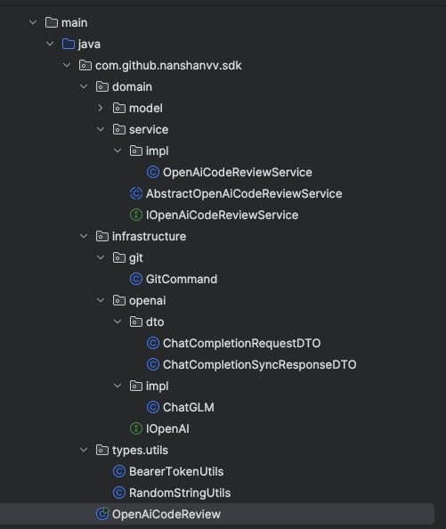

# Write CodeReview Content to Log 

为了把Code Review的内容写到Log中（log仓库的markdown文件形式），我们现在的主函数是

```java
    public static void main(String[] args) throws Exception {

        System.out.println("openai 代码评审测试执行");

      // 新加代码：为了能有权限向log仓库创建文件
        String token = System.getenv("GITHUB_TOKEN");
        if (token == null || token.isEmpty()) {
            throw new RuntimeException("token is null");
        }

        // 1.代码检出
        ProcessBuilder processBuilder = new ProcessBuilder("git", "diff", "HEAD~1", "HEAD");
        processBuilder.directory(new File("."));

        Process process = processBuilder.start();

        BufferedReader reader = new BufferedReader(new InputStreamReader(process.getInputStream()));
        String line;

        StringBuilder diffCode = new StringBuilder();
        while ((line = reader.readLine()) != null){
            diffCode.append(line);
        }

        int exitCode = process.waitFor();
        System.out.println("Exited with code: " + exitCode);
        System.out.println("Diff_Code " + diffCode.toString());

        //2. chatGLM 代码评审
        String log = codeReview(diffCode.toString());
        System.out.println("code Review:" + log);

        //3. 写日志
        String logUrl = writeLog(token, log);
        System.out.println("logUrl:" + logUrl);

    }
```

## 实现writeLog Function

```java
   private static String writeLog(String token, String log) throws Exception {
        Git git = Git.cloneRepository()
                .setURI("https://github.com/nanshanvv/openai-code-review-log.git")
                .setDirectory(new File("repo"))
                .setCredentialsProvider(new UsernamePasswordCredentialsProvider(token, ""))
                .call();

        String dateFolderName = new SimpleDateFormat("yyyy-MM-dd").format(new Date());
        File dateFolder = new File("repo/" + dateFolderName);
        if (!dateFolder.exists()) {
            dateFolder.mkdirs();
        }

        String filename = generateRandomString(12) + ".md";
        File newFile = new File(dateFolder, filename);
        try(FileWriter filewriter = new FileWriter(newFile)) {
            filewriter.write(log);
        }

        git.add().addFilepattern(dateFolderName + "/" + filename).call();
        git.commit().setMessage("Add new File").call();
        git.push().setCredentialsProvider(new UsernamePasswordCredentialsProvider(token, "")).call();
        return "https://github.com/nanshanvv/openai-code-review-log/blob/main/" + dateFolderName + "/" + filename;
    }
```

我们主要用Git命令来实现

主要流程就是

```csharp
[开始执行 writeLog 方法]
        |
        v
[1] 使用 Git.cloneRepository() 克隆远程仓库
    └── URI: https://github.com/xxx/openai-code-review-log.git
    └── 目录: 创建本地 "repo/" 文件夹
        |
        v
[2] 获取当前日期 → yyyy-MM-dd
    └── 示例: "2025-04-25"
        |
        v
[3] 构造本地路径 repo/yyyy-MM-dd/
    └── 如果不存在则 mkdirs()
        |
        v
[4] 生成随机文件名
    └── 示例: "MpxxRiRPtK7Q.md"
        |
        v
[5] 将 log 内容写入 markdown 文件
    └── 路径: repo/2025-04-25/MpxxRiRPtK7Q.md
        |
        v
[6] 使用 git.add() 添加文件
    └── 相对路径: 2025-04-25/MpxxRiRPtK7Q.md
        |
        v
[7] 使用 git.commit() 提交更改
    └── 提交信息: "Add new File"
        |
        v
[8] 使用 git.push() 推送到 GitHub 远程仓库
    └── 使用 token 授权
        |
        v
[9] 返回日志文件访问链接
    └── 示例: https://github.com/xxx/openai-code-review-log/blob/main/2025-04-25/MpxxRiRPtK7Q.md
        |
        v
[结束]
```


## 代码重构 DDD

### GitCommand部分

#### public String diff()

这一段代码主要是把之前提取diff代码的功能给封装了

```java
   public String diff() throws IOException, InterruptedException {
        ProcessBuilder logprocessBuilder = new ProcessBuilder("git", "log", "-1", "--pretty=format:%H");
        logprocessBuilder.directory(new File("."));
        Process logprocess = logprocessBuilder.start();

        BufferedReader logReader = new BufferedReader(new InputStreamReader(logprocess.getInputStream()));
        String latestCommitHash = logReader.readLine();
        logReader.close();
        logprocess.waitFor();

        ProcessBuilder diffProcessBuilder = new ProcessBuilder("git", "diff", latestCommitHash + "^", latestCommitHash);
        diffProcessBuilder.directory(new File("."));
        Process diffProcess = diffProcessBuilder.start();

        StringBuilder diffCode = new StringBuilder();
        BufferedReader diffReader = new BufferedReader(new InputStreamReader(diffProcess.getInputStream()));
        String line;
        while ((line = diffReader.readLine()) != null){
            diffCode.append(line);
        }
        diffReader.close();
        int exitCode = diffProcess.waitFor();
        if (exitCode != 0){
            throw new RuntimeException("diff failed");
        }
        return diffCode.toString();
    }
```

##### 知识补充

1. `ProcessBuilder`

**→ 让 Java 帮你在电脑上执行一条命令。**

比如，正常我们在命令行（Terminal）里会打：

```bash
git diff HEAD^ HEAD
```

现在你在 Java 里面想让程序**自动去执行这条命令**，就要用 `ProcessBuilder`。

简单理解就是：

- `ProcessBuilder` = **Java 帮你敲命令行**
- 然后 Java 可以拿到命令行返回的结果（比如 diff 的输出）

举个例子：

```
java


CopyEdit
ProcessBuilder pb = new ProcessBuilder("git", "diff", "HEAD^", "HEAD");
Process p = pb.start();
```

这就相当于：

- 让电脑去命令行执行 `git diff HEAD^ HEAD`
- 然后拿到执行结果。

------

2. `InputStreamReader`

**→ 把程序运行后输出的“字节流”，转换成“文字”。**

因为 ProcessBuilder 启动的程序，会把结果输出到一种叫**InputStream（输入流）**的东西里。

- 流（Stream） = 一堆数据（可能是字节、二进制数据）
- 但是字节我们人看不懂，需要转成文字

所以用 `InputStreamReader` 来做翻译：

- `InputStreamReader` = **字节 → 文字**（比如 UTF-8 编码）

举个例子：

```java
InputStreamReader isr = new InputStreamReader(p.getInputStream());
```

- 这里 `p.getInputStream()` 是程序的输出
- `InputStreamReader` 帮你把它变成我们能读的文字。

------

3. `BufferedReader`

**→ 让你一行一行地读取文字，速度快，还方便。**

`InputStreamReader` 虽然能读文字，但每次只能读一个字符（一个字母、一个数字）——很慢也很烦。

所以我们用 `BufferedReader` 包一下，让它能：

- **一行一行读取**（readLine）
- **内部有缓存，读取速度也快**

举个例子：

```java
BufferedReader reader = new BufferedReader(new InputStreamReader(p.getInputStream()));
String line = reader.readLine();
```

- 这样可以一整行一整行地拿到 diff 的内容。

------

4. `StringBuilder`

**→ 把很多段文字快速拼接成一整个字符串。**

如果你每次都用 `String a = a + b;` 这样拼字符串，Java 会很慢（因为每次都重新开辟内存）。

所以用 `StringBuilder`：

- 它内部有一块连续的内存
- 可以很快地一段一段地拼起来
- 最后一次性拿到整个大字符串

举个例子：

```java
StringBuilder sb = new StringBuilder();
sb.append("Hello ");
sb.append("World");
String result = sb.toString(); // "Hello World"
```

在你的代码里，就是一行一行地把 diff 内容加到 `StringBuilder` 里，最后得到完整的 diff。

------

##### 简化版流程图

```plaintext
ProcessBuilder → 启动一个 git 命令
          ↓
Process.getInputStream() → 获取命令的输出（字节流）
          ↓
InputStreamReader → 把字节流翻译成文字
          ↓
BufferedReader → 一行一行读出来
          ↓
StringBuilder → 每一行加起来，变成一个完整的大字符串
```

------

总结一下，简单记忆法：

| 名字              | 简单理解                                |
| ----------------- | --------------------------------------- |
| ProcessBuilder    | 帮 Java 执行一条命令（比如 `git diff`） |
| InputStreamReader | 把程序的输出“字节流”翻译成“文字”        |
| BufferedReader    | 一行一行快速地读文字                    |
| StringBuilder     | 很快地拼接很多字符串                    |

#### public String commitAndPush(String recommand)

```java
    public String commitAndPush(String recommand) throws Exception {
        Git git = Git.cloneRepository()
                .setURI(githubReviewLogUrl + ".git")
                .setDirectory(new File("repo"))
                .setCredentialsProvider(new UsernamePasswordCredentialsProvider(githubToken, ""))
                .call();
        String dateFolderName = new SimpleDateFormat("yyyy-MM-dd").format(new Date());
        File dateFolder = new File("repo/" + dateFolderName);
        if (!dateFolder.exists()) {
            dateFolder.mkdirs();
        }
        String filename = project + "-" + branch + "-" + author + System.currentTimeMillis() + RandomStringUtils.randomAlphanumeric(4)+".md";
        File newFile = new File(dateFolder, filename);
        try(FileWriter writer = new FileWriter(newFile)) {
            writer.write(recommand);
        }

        git.add().addFilepattern(dateFolderName + "/" + filename).call();
        git.commit().setMessage("Add new File").call();
        git.push().setCredentialsProvider(new UsernamePasswordCredentialsProvider(githubToken, "")).call();

        logger.info("openai-code-review-log commit successful");
        return githubReviewLogUrl+ "/blob/main/"+dateFolderName + "/" + filename;
    }
```

### OpenAI部分

接口文件：IOpenAI

```java
package com.github.nanshanvv.sdk.infrastructure.openai;

import com.github.nanshanvv.sdk.infrastructure.openai.dto.ChatCompletionRequestDTO;
import com.github.nanshanvv.sdk.infrastructure.openai.dto.ChatCompletionSyncResponseDTO;

public interface IOpenAI {
    ChatCompletionSyncResponseDTO completions(ChatCompletionRequestDTO requestDTO) throws Exception;
}

```

实现类：impl/ChatGLM

```java
package com.github.nanshanvv.sdk.infrastructure.openai.impl;

import com.alibaba.fastjson2.JSON;
import com.github.nanshanvv.sdk.infrastructure.openai.IOpenAI;
import com.github.nanshanvv.sdk.infrastructure.openai.dto.ChatCompletionRequestDTO;
import com.github.nanshanvv.sdk.infrastructure.openai.dto.ChatCompletionSyncResponseDTO;
import com.github.nanshanvv.sdk.types.utils.BearerTokenUtils;

import java.io.BufferedReader;
import java.io.InputStreamReader;
import java.io.OutputStream;
import java.net.HttpURLConnection;
import java.net.URL;
import java.nio.charset.StandardCharsets;

public class ChatGLM implements IOpenAI {

    private final String apiHost;
    private final String apiKeySecret;

    public ChatGLM(String apiHost, String apiKeySecret) {
        this.apiHost = apiHost;
        this.apiKeySecret = apiKeySecret;
    }

    @Override
    public ChatCompletionSyncResponseDTO completions(ChatCompletionRequestDTO requestDTO) throws Exception {
        String token = BearerTokenUtils.getToken(apiKeySecret);
        URL url = new URL(apiHost);
        HttpURLConnection connection = (HttpURLConnection) url.openConnection();

        connection.setRequestMethod("POST");
        connection.setRequestProperty("Authorization", "Bearer " + token);
        connection.setRequestProperty("Content-Type", "application/json");
        connection.setRequestProperty("User-Agent", "Mozilla/4.0 (compatible; MSIE 5.0; Windows NT; DigExt)");
        connection.setDoOutput(true);

        try (OutputStream os = connection.getOutputStream()) {
            byte[] input = JSON.toJSONString(requestDTO).getBytes(StandardCharsets.UTF_8);
            os.write(input,0,input.length);
        }

        BufferedReader in = new BufferedReader(new InputStreamReader(connection.getInputStream()));
        String inputLine;

        StringBuilder content = new StringBuilder();
        while ((inputLine = in.readLine()) != null) {
            content.append(inputLine);
        }

        in.close();
        connection.disconnect();
        return JSON.parseObject(content.toString(), ChatCompletionSyncResponseDTO.class);
    }
}

```

### Main运行

```java
package com.github.nanshanvv.sdk;

import com.alibaba.fastjson2.JSON;
import com.github.nanshanvv.sdk.domain.service.impl.OpenAiCodeReviewService;
import com.github.nanshanvv.sdk.infrastructure.git.GitCommand;
import com.github.nanshanvv.sdk.infrastructure.openai.IOpenAI;
import com.github.nanshanvv.sdk.infrastructure.openai.dto.ChatCompletionRequestDTO;
import com.github.nanshanvv.sdk.infrastructure.openai.dto.ChatCompletionSyncResponseDTO;
import com.github.nanshanvv.sdk.domain.model.Model;
import com.github.nanshanvv.sdk.infrastructure.openai.impl.ChatGLM;
import com.github.nanshanvv.sdk.types.utils.BearerTokenUtils;
import org.eclipse.jgit.api.Git;
import org.eclipse.jgit.transport.UsernamePasswordCredentialsProvider;
import org.slf4j.Logger;
import org.slf4j.LoggerFactory;

import java.io.*;
import java.net.HttpURLConnection;
import java.net.URL;
import java.nio.charset.StandardCharsets;
import java.text.SimpleDateFormat;
import java.util.ArrayList;
import java.util.Date;
import java.util.Random;

public class OpenAiCodeReview {

    private static final Logger logger = LoggerFactory.getLogger(OpenAiCodeReview.class);
    // ChatGLM 配置
    private String chatglm_apiHost = "https://open.bigmodel.cn/api/paas/v4/chat/completions";
    private String chatglm_apiKeySecret = "";

    // Github 配置
    private String github_review_log_uri;
    private String github_token;

    // 工程配置 - 自动获取
    private String github_project;
    private String github_branch;
    private String github_author;

    public static void main(String[] args) throws Exception {
        GitCommand gitCommand = new GitCommand(
                getEnv("GITHUB_REVIEW_LOG_URI"),
                getEnv("GITHUB_TOKEN"),
                getEnv("COMMIT_PROJECT"),
                getEnv("COMMIT_BRANCH"),
                getEnv("COMMIT_AUTHOR"),
                getEnv("COMMIT_MESSAGE")
        );

        IOpenAI openAI = new ChatGLM(getEnv("CHATGLM_APIHOST"), getEnv("CHATGLM_APIKEYSECRET"));

        OpenAiCodeReviewService openAiCodeReviewService = new OpenAiCodeReviewService(gitCommand, openAI);
        openAiCodeReviewService.exec();

        logger.info("openai-code-review done!");
    }

    private static String getEnv(String key) {
        String value = System.getenv(key);
        if (null == value || value.isEmpty()) {
            throw new RuntimeException("value is null");
        }
        return value;
    }

}


```

### 层级结构

最后文件结构是



#### 1. 层次分布 (Layers)

- **Application Layer** (应用层)
  - 起动入口，组合实体，经营流程
- **Domain Layer** (领域层)
  - 根据项目核心逻辑，定义服务策略
- **Infrastructure Layer** (基础设施层)
  - 连接外部系统，实现具体进程，如接口请求，git操作
- **Utils Layer** (工具层)
  - 公用功能，如 Token 获取，随机字符串生成

#### 2. 主要类分工 (Class Responsibilities)

| 类名                              | 层级                     | 任务                                         |
| --------------------------------- | ------------------------ | -------------------------------------------- |
| `OpenAiCodeReview`                | Application              | main()，起动入口，组合依赖，执行 exec        |
| `OpenAiCodeReviewService`         | Domain                   | 核心服务，执行领域逻辑：Diff -> 评审 -> 提交 |
| `AbstractOpenAiCodeReviewService` | Domain                   | 定义领域服务骤序框架，拟类                   |
| `GitCommand`                      | Infrastructure           | 跟 Git 交互，执行 clone/diff/commit/push     |
| `ChatGLM`                         | Infrastructure           | 跟模型进行 HTTP 请求，实现 IOpenAI           |
| `IOpenAI`                         | Infrastructure Interface | 定义大模型调用规范，公用接口                 |
| `BearerTokenUtils`                | Utils                    | 根据 API Key 生成认证标识 Token              |
| `RandomStringUtils`               | Utils                    | 生成随机数字串                               |

#### 3. 类之间连接 (Class Relations)

```
OpenAiCodeReview
    ├─→ GitCommand
    ├─→ ChatGLM (implements IOpenAI)
    └─→ OpenAiCodeReviewService (extends AbstractOpenAiCodeReviewService)
           ├─→ GitCommand.diff()
           ├─→ ChatGLM.completions()
           └─→ GitCommand.commitAndPush()
```

- `OpenAiCodeReview` 起动入口，组合 Git 操作 + 模型对话 + 领域服务
- `OpenAiCodeReviewService` 依赖基础服务，执行评审逻辑
- 全线通过接口 `IOpenAI` 分隔了依赖，无绑定
