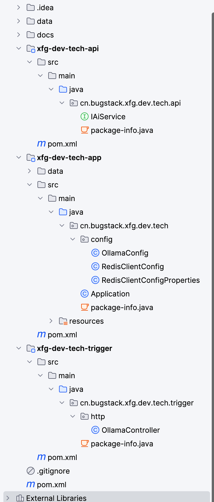

# 流式应答接口实现

## 项目结构



| 模块名                | 职责                                                         |
| --------------------- | ------------------------------------------------------------ |
| `sc-dev-tech-api`     | 定义接口（如 `IAiService`），是共享 API 或 SPI（抽象层）     |
| `sc-dev-tech-app`     | Spring Boot 启动主应用，含主类 `Application.java` 和配置类   |
| `sc-dev-tech-trigger` | 提供触发器或 Web 层（如 `RestController`），更偏向用户接口层 |

## 核心代码

```java
package cn.shuchang.sc.dev.tech.trigger.http;

import cn.shuchang.sc.dev.tech.api.IAiService;
import jakarta.annotation.Resource;
import org.springframework.ai.chat.ChatResponse;
import org.springframework.ai.chat.prompt.Prompt;
import org.springframework.ai.ollama.OllamaChatClient;
import org.springframework.ai.ollama.api.OllamaOptions;
import org.springframework.web.bind.annotation.*;
import reactor.core.publisher.Flux;


@RestController
@CrossOrigin("*")
@RequestMapping("/api/v1/ollama")
public class OllamaController implements IAiService {
    @Resource
    private OllamaChatClient chatClient;

    @RequestMapping(value = "generate", method = RequestMethod.GET)
    @Override
    public ChatResponse generate(@RequestParam String model, @RequestParam String message) {
        return chatClient.call(new Prompt(message, OllamaOptions.create().withModel(model)));
    }

    @RequestMapping(value = "generate_stream", method = RequestMethod.GET)
    @Override
    public Flux<ChatResponse> generateStream(@RequestParam String model, @RequestParam String message) {
        return chatClient.stream(new Prompt(message, OllamaOptions.create().withModel(model)));
    }
}

```

| 路由                             | 方法 | 描述                         |
| -------------------------------- | ---- | ---------------------------- |
| `/api/v1/ollama/generate`        | GET  | 单次生成 AI 回答             |
| `/api/v1/ollama/generate_stream` | GET  | 流式返回 AI 输出（多段输出） |

**PS:**`@RequestParam` 是用来**接收 HTTP 请求 URL 中的参数**的注解。

当你访问：

```bash
http://localhost:8090/api/v1/ollama/generate?model=deepseek-r1:1.5b&message=hi
```

你的 Controller 方法：

```java
public ChatResponse generate(@RequestParam String model, @RequestParam String message)
```

就会自动将：

- `model=deepseek-r1:1.5b` 映射给参数 `String model`
- `message=hi` 映射给参数 `String message`

# 用AI生成前端页面

## Prompt

```text
请根据以下信息，编写UI对接服务端接口；

流式GET请求接口，由 SpringBoot Spring AI 框架实现，如下；

/**
 * curl http://localhost:8090/api/v1/ollama/generate_stream?model=deepseek-r1:1.5b&message=1+1
 */
@RequestMapping(value = "generate_stream", method = RequestMethod.GET)
@Override
public Flux<ChatResponse> generateStream(@RequestParam String model, @RequestParam String message) {
    return chatClient.stream(new Prompt(
            message,
            OllamaOptions.create()
                    .withModel(model)
    ));
}

流式GET应答数据，数组中的一条对象；

[
    {
        "result": {
            "output": {
            "messageType": "ASSISTANT",
            "properties": {
                "id": "chatcmpl-B3HPw95SsqmhoWeJ8azGLxK1Vf4At",
                "role": "ASSISTANT",
                "finishReason": ""
            },
            "content": "1",
            "media": []
            },
            "metadata": {
                "finishReason": null,
                "contentFilterMetadata": null
                }
        }
    }
]

如描述说明，帮我编写一款简单的AI对话页面。

1. 输入内容，点击发送按钮，调用服务端流式请求接口，前端渲染展示。
2. 以html、js代码方式实现，css样式使用 tailwind 编写。
3. 通过 const eventSource = new EventSource(apiUrl); 调用api接口。    
4. 从 result.output.content 获取，应答的文本展示。注意 content 可能为空。
5. 从 result.metadata.finishReason = STOP 获取，结束标识。
6. 注意整体样式的简洁美观。

```

# RAG部署

## 业务逻辑

上传文件（知识库）-> 用TikaDocumentReader解析文件，然后用TokenTextSplitter来对文件进行拆分->遍历这个文档进行标记->把这些拆解并且有标记的文件向量化存到postgresql向量库中

## 主要代码

```java
@Slf4j
@RunWith(SpringRunner.class)
@SpringBootTest
public class RAGTest {
    @Resource
    private OllamaChatClient ollamaChatClient;
    @Resource
    private TokenTextSplitter tokenTextSplitter;
    @Resource
    private SimpleVectorStore simpleVectorStore;
    @Resource
    private PgVectorStore pgVectorStore;
    @Test
    public void upload(){
        TikaDocumentReader reader = new TikaDocumentReader("./data/file.text");
        List<Document> documents = reader.get();
        List<Document> documentSplitterList = tokenTextSplitter.apply(documents);

        documents.forEach(doc -> doc.getMetadata().put("knowledge", "知识库名称"));
        documentSplitterList.forEach(doc -> doc.getMetadata().put("knowledge", "知识库名称"));

        pgVectorStore.accept(documentSplitterList);

        log.info("Upload Success!");
    }
    @Test
    public void chat(){
        String message = "王二哪年出生";

        String SYSTEM_PROMPT = """
                Use the information from the DOCUMENTS section to provide accurate answers but act as if you knew this information innately.
                If unsure, simply state that you don't know.
                Another thing you need to note is that your reply must be in Chinese!
                DOCUMENTS:
                    {documents}            
                """;

        SearchRequest request = SearchRequest.query(message).withTopK(5).withFilterExpression("knowledge == '知识库名称'");

        List<Document> documents = pgVectorStore.similaritySearch(request);
        String documentsCollectors = documents.stream().map(Document::getContent).collect(Collectors.joining());

        Message ragMessage = new SystemPromptTemplate(SYSTEM_PROMPT).createMessage(Map.of("documents", documentsCollectors));

        ArrayList<Message> messages = new ArrayList<>();
        messages.add(new UserMessage(message));
        messages.add(ragMessage);

        ChatResponse chatResponse = ollamaChatClient.call(new Prompt(messages, OllamaOptions.create().withModel("deepseek-r1:1.5b")));

        log.info("Chat Response: {}", JSON.toJSONString(chatResponse));
    }

}
```

### 打标签并上传数据库

```java
        documentSplitterList.forEach(doc -> doc.getMetadata().put("knowledge", "知识库名称"));

        pgVectorStore.accept(documentSplitterList);
```

用 Tika 读取了一个文档，比如：

```arduino
文本内容：
"LLMs can be used in RAG systems for document search."
```

这时候你得到一个对象：

```java
Document doc = new Document("LLMs can be used in RAG systems for document search.");
```

如果你执行了：

```java
doc.getMetadata().put("knowledge", "技术知识库");
```

你相当于给这个文档**打了一个标签** ➜ 它属于 “技术知识库”。

```java
doc.getMetadata().put("knowledge", "知识库名称");
```

就是：

> 给这个文档的 metadata 加一个键值对：
>  `key = "knowledge"`，`value = "知识库名称"`

------

 最终这个 `Document` 里面包含的东西就像：

```java
Document {
    text = "LLMs can be used in RAG systems for document search.",
    metadata = {
        "knowledge": "技术知识库"
    }
}
```

###  metadata 有什么用？

当你把这个文档上传到向量数据库（比如 `pgVectorStore`）后：

- 它不仅存了内容向量；
- 还存了这条 metadata；
- 将来你做查询时可以只查 `"knowledge" = 技术知识库"` 的内容。

## RAG流程

```java
   public void chat(){
        String message = "王二哪年出生";

        String SYSTEM_PROMPT = """
                Use the information from the DOCUMENTS section to provide accurate answers but act as if you knew this information innately.
                If unsure, simply state that you don't know.
                Another thing you need to note is that your reply must be in Chinese!
                DOCUMENTS:
                    {documents}            
                """;

        SearchRequest request = SearchRequest.query(message).withTopK(5).withFilterExpression("knowledge == '知识库名称'");

        List<Document> documents = pgVectorStore.similaritySearch(request);
        String documentsCollectors = documents.stream().map(Document::getContent).collect(Collectors.joining());

        Message ragMessage = new SystemPromptTemplate(SYSTEM_PROMPT).createMessage(Map.of("documents", documentsCollectors));

        ArrayList<Message> messages = new ArrayList<>();
        messages.add(new UserMessage(message));
        messages.add(ragMessage);

        ChatResponse chatResponse = ollamaChatClient.call(new Prompt(messages, OllamaOptions.create().withModel("deepseek-r1:1.5b")));

        log.info("Chat Response: {}", JSON.toJSONString(chatResponse));
    }
```

其中以下代码为重点：

```java
        String documentsCollectors = documents.stream().map(Document::getContent).collect(Collectors.joining());
```

```java
documents               // 一个文档列表
  .stream()             // ➜ 我想对每个文档做处理
  .map(...)             // ➜ 把每个文档提取正文
  .collect(...)         // ➜ 把它们合起来成一个字符串

```

## 补充知识：map()与stream()

### 1.什么是 `stream()`

在 Java 中，`List`、`Set`、`Map` 等集合可以通过 `.stream()` 把它们转化成“**流式数据结构**”，然后可以一步步处理数据（比如：筛选、映射、分组、统计……）

🎯 目的：

- 替代 `for` 循环的繁琐；
- 让你像流水线一样写代码（一步步加工）。

------

### 2.什么是 `map()`？

`.map()` 是 `stream()` 中一个非常常用的操作，表示：

> 把集合中的每个元素，**“转换”成另一个东西**

------

### 3.对比：传统 vs Stream + Map

📍传统写法（for 循环）：

```java
List<String> names = new ArrayList<>();
for (User user : users) {
    names.add(user.getName());
}
```

✅ Stream 写法：

```java
List<String> names = users.stream()
    .map(User::getName)
    .collect(Collectors.toList());
```

------

### 4.多个实用例子（含解释）

------

✅ 示例 1：数字翻倍

原始数据：

```java
List<Integer> nums = List.of(1, 2, 3, 4, 5);
```

🚀 目标：

把每个数字变成它的2倍

🔁 for 循环写法：

```java
List<Integer> doubled = new ArrayList<>();
for (Integer n : nums) {
    doubled.add(n * 2);
}
```

✅ Stream + map：

```java
List<Integer> doubled = nums.stream()
    .map(n -> n * 2)
    .collect(Collectors.toList());
```

------

✅ 示例 2：取出文档的正文内容

```java
List<Document> docs = ...;
List<String> contents = docs.stream()
    .map(Document::getContent)
    .collect(Collectors.toList());
```

等价于：

```java
List<String> contents = new ArrayList<>();
for (Document doc : docs) {
    contents.add(doc.getContent());
}
```

------

✅ 示例 3：用户对象转为用户名字符串（带 filter）

```java
List<String> names = users.stream()
    .filter(u -> u.getAge() >= 18)   // 过滤：只要成年人
    .map(User::getName)              // 转成名字
    .collect(Collectors.toList());   // 收集成新的 List
```

------

### 5.如果不用 `stream` 和 `map` 会怎样？

| 点               | 差别                                    |
| ---------------- | --------------------------------------- |
| 📄 代码更长       | 要手动建新列表、for 循环、add 元素      |
| 😵 可读性差       | 不容易快速理解整体逻辑                  |
| 🧪 不支持链式处理 | 无法灵活组合 map、filter、reduce 等操作 |
| 😭 容易出错       | 增删元素等容易漏写或出错                |


------

### 6.总结一张图：

| 操作            | 用法               | 说明                              |
| --------------- | ------------------ | --------------------------------- |
| `.stream()`     | 把列表转成“流”     | 进入函数式处理模式                |
| `.map(f)`       | 把每个元素转成新值 | f 是 lambda 或方法引用            |
| `.filter(f)`    | 过滤元素           | 只保留满足条件的元素              |
| `.collect(...)` | 把流变成新列表     | 常用：`.toList()` 或 `.joining()` |
